This chapter covers the administration of a MISP instance: managing users,
organisations and roles; the server settings and diagnostics tool; blocklists,
correlation management and logging; background processing; and the command-line
maintenance tools. Most of the actions described here require site-admin
privileges, though organisation admins can perform a subset of them within their
own organisation.

- - -

## Users
As an admin (not to be confused with Org Admin), you can set up new accounts for users, edit user profiles, delete them, or just have a look at all the viewers' profiles. Organisation admins (Org Admin) are restricted to executing these actions exclusively within their own organisation’s users only.

### Adding a new user

To add a new user, click on the Add User button in the administration menu to the left and populate the fields available the loaded view:


*   **Email:** The user's e-mail address, this will be used as his/her login name and as an address to send all automated e-mails as well as e-mails sent by contacting the user as the reporter of an event.
*   **Set password:** Tick the box if you want to define a temporary user-password for the user. If you don't, you should use the action button 'reset password' in the 'List Users' view to generate one and send it by email to the user.
*   **Password:** *This textbox is displayed only when 'Set password' is ticked.* A Temporary password for the user that he/she should change after the first login. Ensure that password pass the [MISP password policy](https://misp.gitbooks.io/misp-book/content/quick-start/#password-policy).
*   **Confirm Password:** *This textbox is displayed only when 'Set password' is ticked.* This should be an exact copy of the Password field.
*   **Organisation:** A drop-down list enables you to choose an organisation for the user. To learn more about organisation, [click here](#organisations).
*   **Roles:** A drop-down list allows you to select a role-group that the user should belong to. Roles define user privileges attributed to the user. To learn more about roles, [click here](#roles).
*   **Authkey:** This is assigned automatically and is the unique authentication key of said user (he/she will be able to reset this and receive a new key). It is used for exports and for connecting one server to another, but it requires the user to be assigned to a role that has auth permission enabled.
*   **NIDS SID:** Network Intrusion Detection System (NIDS) Signature ID (SID). Snort rules exported by the created user will have the offset defined in the user profile and each rule generated during the export will receive an incrementing SID starting with the user's offset. If no SID offset is specified a default, randomized value will be set.
*   **Sync user for:** If this option is set, the selected server's push rules will also be applied when this local user is used to pull from a remote instance. This option is available for admin, Org Admin and Sync user role.
*   **Gpgkey:** The key used to encrypt e-mails sent through the system.
*   **Fetch GnuPG key:** Fetch GnuPG public key.
*   **Receive alerts when events are published:** This option will subscribe the new user to automatically generated e-mails whenever an event is published.
*   **Receive alerts from "contact reporter" requests:** This option will subscribe the new user to e-mails that are generated when another user tries to get in touch with an event's reporting organisation that matches that of the new user.
*   **Disable this user account:** Tick it if you want to disable this user account. (preferred to removing an account)

### Listing all users

To list all current users of the system, just click on List Users under the administration menu to the left. A view will load containing a list of all users and the following columns of information:

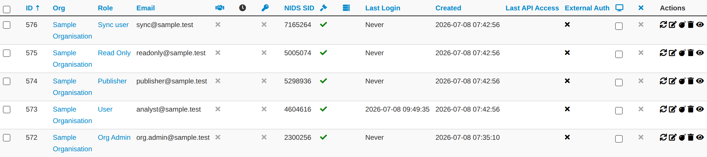

*   **Id:** The user's automatically assigned ID number.
*   **Org:** The organisation that the user belongs to.
*   **Email:** The e-mail address (and login name) of the user.
*   **Authkey:** Unique authentication key of the user.
*   **Autoalert:** Shows whether the user has subscribed to auto-alerts and is continuing to receive mass-emails regarding newly published events that he/she is eligible for.
*   **Contactalert:** Shows whether the user has the subscription to contact reporter e-mails directed at his/her organisation is turned on or off.
*   **Gpgkey:** Shows whether the user has entered a GnuPG key yet.
*   **Nids Sid:** Displays the currently assigned NIDS ID.
*   **Termsaccepted:** This flag indicates whether the user has accepted the terms of use or not.
*   **Last login:** Date of last login.
*   **Disabled:** Displays the user status. Enabled or disabled.
*   **Action Buttons:** There are 4 options available: reset the password, edit the user, delete the user or display a user's information. These options are also available on the left menu.
	*    **Reset Password:** Use this action to reset a password. If you've created a new user without A password, tick the 'First time registration' checkbox to send a welcome message. Otherwise a reset password message will be sent.

	*    **Edit the user:** Same options of create user's view. Only a few options are available here:
		*   **Terms accepted:** Indicates whether the user has accepted the terms of use already or not.
		*   **Change Password:** Setting this flag will require the user to change password after the next login.
		*   **Reset Auth Key:** Use this link for generate a new AuthKey.

	*    **Delete the user:** If you want to delete a user. (Note: disabling is the preferred method)

	*    **Display the user:** Display all user's information.<br />


### Contacting a user

Site admins can use the "Contact users" feature to send all or individual user an e-mail. Users that have a GnuPG key set will receive their e-mails encrypted. When clicking this button on the left, you'll be presented with a form that allows you to specify the type of the e-mail, who it should reach and what the content is using the following options:


*   **Action:** This defines the e-mail type, which can be a custom message or a password reset. Password resets automatically include a new temporary password at the bottom of the message and will automatically change the user's password accordingly.
*   **Subject:** In the case of a custom e-mail, you can enter a subject line here.
*   **Recipient:** The recipient toggle lets you contact all your users, a single user (which creates a second drop-down list with all the e-mail addresses of the users) and potential future users (which opens up a text field for the e-mail address and a text area field for a GnuPG public key).
*   **Custom message checkbox:** This is available for password resets and for welcome messages. You can either write your own message (which will be appended with a temporary key and the signature), or let the system generate one automatically.

Keep in mind that all e-mails sent through this system, in addition to your own message, will be signed in the name of the instance's host organisation's support team, the e-mail will also include the e-mail address of the instance's support (if the contact field is set in the bootstrap file), and will include the instance's GnuPG signature for users that have a GnuPG key set (and thus are eligible for an encrypted e-mail).

:warning: GnuPG instance key is the GnuPG key used by the MISP instance and which is only used to sign notification. The GnuPG key used in the MISP instance must not be used anywhere else and should not be valuable.

- - -

## Organisations

Each users belongs to an organisation. As admin, you can manage these organisations.

### Adding a new organisation

To add a new organisation, click on the "Add Organisation" button in the administration menu to the left and fill out the following fields in the view that is loaded:


*   **Local organisation:** If the organisation should have access to this instance, tick the checkbox. If you would only like to add a known external organisation for inclusion in sharing groups, uncheck it.
*   **Organisation Identifier:** Name your organisation. If you want to add a picture, you should add a file on the webserver using the 'Server Settings menu'. Picture should have the same name. To learn more about server settings menu, [click here](#server-settings-and-maintenance).
*   **Uuid:** Unique identifier. If you want to share organisation between MISP multi-instance, use the same Uuid.
*   **A brief description of the organisation:** A word for describing the organisation.
*   **Nationality:** A drop-down list for selecting the country of organisation.
*   **Sector:** Define the sector of organisation (financial, transport, telecom…)
*   **Type of organisation:** Define the type of the organisation.
*   **Contacts:** You can add some contact details for the organisation.

### Listing all organisations

To list all current organisations of the system, just click on List Organisations under the administration menu to the left. There are 3 tabs in this view to filter local organisations, remote organisations or both. The default view displays local organisations. For all views the following columns of information are available:

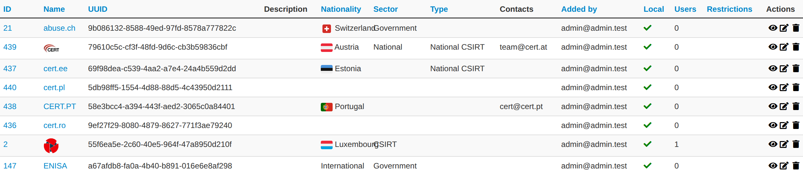

*   **Id:** The organisation's automatically assigned ID number.
*   **Logo:** Picture of the organisation.
*   **Name:** Name of the organisation.
*   **Uuid:** Unique identifier of organisation. Share this Uuid when using it between MISP's multi-instance.
*   **Description:** Description of the organisation.
*   **Nationality:** Country of the organisation.
*   **Sector:** Sector defined for the organisation.
*   **Type:** Type of organisation.
*   **Contacts:** Contacts of organisation.
*   **Added by:** Login of the user who added the organisation
*   **Local:** Flag defined if the organisation is local or remote.
*   **Users:** The amount of users on this instance belonging to the organisation.
*   **Actions:**  There are 3 options available: edit, delete or display an organisation's information. These options are also available on the left menu when you are on the display view.
	*    **Edit Organisation:** Same options of create organisation's view.

	*    **Delete Organisation:** Use this option for deleting organisation.<br />

	*    **View Organisation:** Use this option to display information about the selected organisation. In this view, you can display the user belongs to this organisation and events published by organisation.


### Merge organisations
Merge Organisation menu is available only in the organisation view, under the left menu. Merging one organisation into another will transfer all users and data from one organisation to a different one. The organisation of which the users and data will be transferred is displayed on the left, the target organisation is displayed on the right.


- - -

## Roles

Privileges are assigned to users through **roles**. A role combines a base
**permission level** (what the user can do with events) with a set of individual
permission flags (access to specific features).

The base permission level is chosen from a single **Permissions** dropdown with
four options:

*   **Read Only:** Browse the events the user's organisation has access to,
    without making any changes.
*   **Manage Own Events:** Create, modify and delete the user's own events, but
    not publish them.
*   **Manage Organisation Events:** Create events, and modify or delete any event
    belonging to the user's organisation.
*   **Manage and Publish Organisation Events:** All of the above, plus publishing
    the organisation's events.

On top of the base level, the following individual permissions can be granted
(each is a checkbox on the role form):

| Permission | Grants |
|---|---|
| **Site Admin** | Unrestricted access to all data and functionality on the instance. |
| **Org Admin** | Limited administration — create and manage the users of the own organisation. |
| **Sync Actions** | Use the account as a synchronisation user; its authentication key can be given to a remote instance's administrator to enable sync. |
| **Internal Sync Actions** | Internal sync strategy — distribution levels are not downgraded on pull (for connections within a trusted community). |
| **Authoritative Sync Actions** | Treat the source as authoritative; local data is mirrored to match the source (including deletions). |
| **Audit Actions** | Access the audit logs of the user's organisation. |
| **Auth key access** | Use an authentication key for API access. |
| **Regex Actions** | Edit the regular-expression replacement rules (dangerous — a bad expression can cause data loss or infinite loops). |
| **Tagger** | Attach and detach existing tags to and from events and attributes. |
| **Tag Editor** | Create new tags. |
| **Template Editor** | Create and modify event templates. |
| **Sharing Group Editor** | Create and modify sharing groups. |
| **Delegations Access** | Create delegation requests for own-organisation events. |
| **Sighting Creator** | Submit sightings (feedback on attributes). |
| **Object Template Editor** | Create and modify MISP object templates. |
| **Galaxy Editor** | Create and modify galaxies and galaxy clusters. |
| **Decaying Model Editor** | Create and modify decaying models. |
| **ZMQ publisher** | Publish data to the ZeroMQ pub/sub channel. |
| **Kafka publisher** | Publish data to Kafka. |
| **Warninglist Editor** | Manage warninglists. |
| **View Feed Correlations** | View feed correlations (carries a performance cost). |
| **Analyst Data Creator** | Create and modify analyst data (notes, opinions, relationships). |
| **Skip OTP Reqs** | Exempt the account from one-time-password requirements (for service accounts); has no effect unless OTP is required instance-wide. |
| **Server Signing** | Access the cryptographic server-signing endpoint. |

MISP ships with a set of default roles — **admin** (full site admin), **Org
Admin**, **User** (the default role for new users: manage organisation events
without publishing), **Publisher**, **Sync user** and **Read Only** — which you
can use as they are or as a starting point for your own.

### Adding a new role

When creating a new role, you will have to enter a name for the role to be created and set up permissions (as described above) using the drop-down menu and related check-boxes.


### Listing roles

By clicking on the List Roles button, you can view a list of all currently registered roles and their enabled permissions. In addition, you can find buttons that allow you to edit and delete said roles. Keep in mind that you will need to first remove every member from a role before you can delete it.

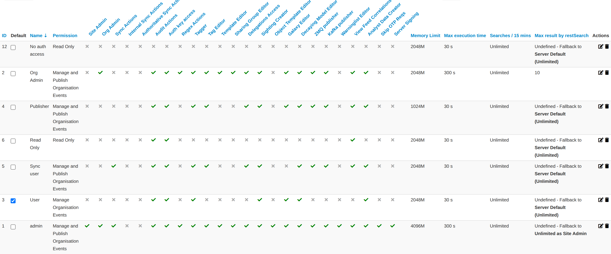

*   **Id:** The role's automatically assigned ID number.
*   **Name:** The name of role.
*   **Permission:** One of the 4 permissions: Read Only, Manage My Own Events, Manage Organization Events, Manage & Publish Organisation Events.
*   **Permission flags:** A column for each individual permission (see the table above), showing whether the role grants it.
*   **Action Buttons:** There are 2 options available: Edit Role or Delete it.
	*    **Edit Role:** Same options of create role's view.<br />

	*    **Delete Role:** Use this option to delete a role.<br />


- - -

## Tools

MISP has a couple of administrative tools that help administrators keep their instance up to date and healthy. The list of these small tools can change rapidly with each new version, but they should be self-explanatory. Be sure to check this section after each upgrade to a new version, just in case there's a new upgrade script in there - though if this is the case it will be mentioned in the upgrade instructions.


- - -

##  Server settings and maintenance
Since version 2.3, MISP has a settings and diagnostics tool that allows site-admins to manage and diagnose their MISP installation. You can access this by navigating to Administration - Server settings & Maintenance.

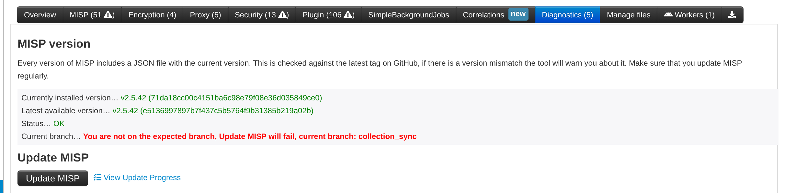

The settings and diagnostics tool is split up into several aspects, all accessible via the tabs on top of the tool. For any unset or incorrectly set setting, or failed diagnostic a number next to the tab name will indicate the number and severity of the issues. If the number is written with a red font, it means that the issue is critical. First, let's look at the various tabs:
*   **Overview**: General overview of the current state of your MISP installation
*   **MISP settings**: Basic MISP settings. This includes the way MISP handles the default settings for distribution settings, whether background jobs are enabled, etc
*   **GnuPG settings**: GnuPG related settings.
*   **Proxy settings**: HTTP proxy related settings.
*   **Security settings**: Settings controlling brute-force protection and the application's salt key.
*   **Misc settings**: Settings controlling debug options, please ensure that debug is always disabled on a production system.
*   **Diagnostics**: The diagnostics tool checks if all directories that MISP uses to store data are writeable by the apache user. Also, the tool checks whether the STIX libraries and GnuPG are working as intended.
*   **Workers**: Shows the background workers (if enabled) and shows a warning if they are not running. Admins can also restart the workers here.
*   **Download report**: Download a report of all the settings visible in the tool, in JSON format.

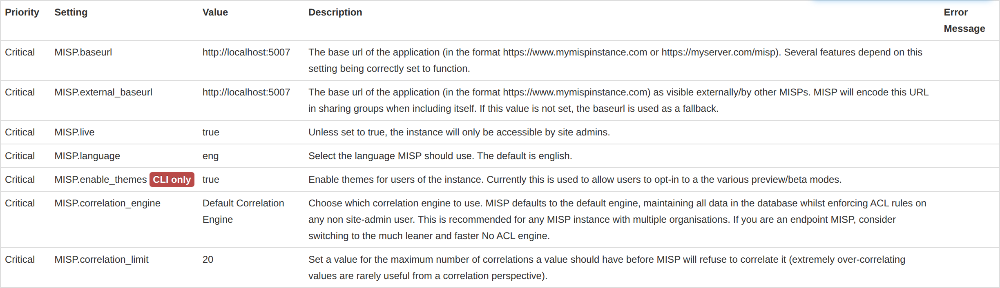

Each of the setting pages is a table with each row representing a setting. Coloured rows indicate that the setting is incorrect / not set and the colour determines the severity (red = critical, yellow = recommended, green = optional). The columns are as follows:
*   **Priority**: The severity of the setting.
*   **Setting**: The setting name.
*   **Value**: The current value of the setting.
*   **Description**: A description of what the setting does.
*   **Error Message**: If the setting is incorrect / not set, this field will let the user know what is wrong.

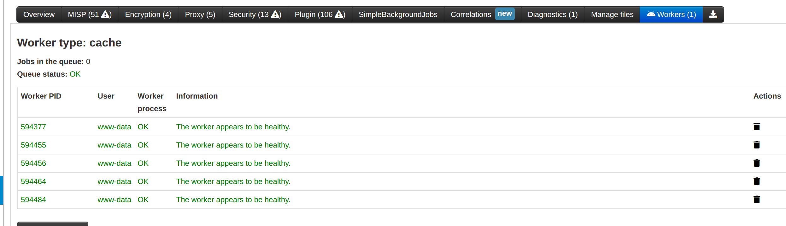

The workers tab shows a list of the workers that MISP can use. In MISP 2.5 the background worker system is **SimpleBackgroundJobs**, managed by [Supervisor](http://supervisord.org/) and backed by Redis; the legacy CakeResque worker system has been removed. You can restart the workers from this page with the "restart all workers" button, but starting and stopping them is normally handled by Supervisor (the `misp-workers` service installed by the setup scripts).

*   **Worker Type**: The worker type is determined by the queue it monitors. MISP has 6 queues: `default`, `email`, `cache`, `prio`, `update` and `scheduler`.
*   **Worker Id**: The ID is made up of the machine name, the PID of the worker and the queue it monitors.
*   **Status**: Displays OK if the worker is running.

### Worker types

Each worker monitors one Redis-backed queue:

*   **default**: General-purpose background jobs that are not handled by a more specific queue.
*   **email**: Sending notification and alert e-mails.
*   **cache**: Building caches — feed caches, warninglist caches and export caches.
*   **prio**: High-priority, often user-triggered jobs (for example publishing an event) so they are not held up behind long-running tasks.
*   **update**: Running MISP updates and database schema migrations.
*   **scheduler**: Enqueues recurring/scheduled jobs onto the other queues at the configured times.


### Restarting or starting the workers

Even if the workers are stopped, any actions queued for them are simply on hold — nothing is lost. Starting the workers again resumes any pending operations.

Under Supervisor the workers start automatically (including on boot); you can also restart them from the **Workers** tab in the UI. From the command line, control the worker processes with `supervisorctl` and inspect the queues with the `Worker` console shell (see [Managing the background workers](#managing-the-background-workers)):

```bash
sudo supervisorctl status misp-workers:*
sudo supervisorctl restart misp-workers:*
```

## Blocklists and block rules

It is possible to block certain events or organisations from ever being added to the system. Administrators can add, edit or delete blocklisted items. The appropriate pages are linked in the Administration menu.

### Event blocklist
Blocklisting an event prevents the event from being added on the instance. Blocklisting an existing event will not result in the event being removed. The event will still be editable as well. Blocklisting events functionality is enabled by default. If blocklisting events is enabled, deleted events will automatically be added to the event blocklist. Enabling/disabling event blocklisting can be done using the MISP settings view.


#### Blocklisting an event
The blocklist event screen can be accessed through the main administration menu. You can enter the UUID of one event or a list of event UUIDs (one per line). If the optional fields creating organisation, event info or comment are filled in, their values will be added for all added UUIDs.


#### Viewing event blocklist entries
The list of blocklisted events can be accessed through the main administration menu. You can delete a blocklist entry or access the edit screens for specific blocklisted events from here.


### Event block rules
Event block rules allow you to add a simple tag filter to block events from being added or synced.

An example of a rule can be found below:

    {
    "tags": ["tag1", "tag2"]
    }

The rule will block:
- Syncing of events with "tag1" or "tag2"
- Direct adding of events with "tag1" or "tag2" in one go, for example using /events/add

The rule will not block:
- The adding of "tag1" or "tag2" to an existing event through non syncing actions, for example by adding it via the graphical user interface.

It is not possible to add more complex rules with boolean logic (NOT, AND).

Event block rules are managed under **Administration → Event Block Rules** and are stored as a single JSON rule.

### Organisation blocklist
Blocklisting an organisation prevents the creation of any event by the blocklisted organisation. It does not prevent a local user from the blocklisted organisation from logging in or viewing data.


When syncing, events created by blocklisted organisations will not be added to the instance. Updates will also not propagate. A user from a blocklisted organisation can still edit an event from the blocklisted organisation locally though. Blocklisting organisations functionality is enabled by default. Enabling/disabling organisation blocklisting can be done using the MISP settings view.


#### Blocklisting an organisation
The blocklist organisation screen can be accessed through the main administration menu. You can enter the UUID of one organisation or a list of organisations UUIDs (one per line). If the optional fields organisation name or comment are filled in, their values will be added for all added UUIDs.


#### Viewing organisation blocklist entries
The list of blocklisted organisations can be accessed through the main administration menu. You can delete a blocklist entry or access the edit screens for specific blocklisted organisations from here.


### Sighting blocklist

Blocklisting an organisation for sightings prevents any sightings created by that
organisation from being stored on the instance (locally or via sync) — useful for
filtering out a noisy or untrusted source of sighting feedback. Sighting
blocklisting is enabled by default (`MISP.enableSightingBlocklisting`) and is
managed from the administration menu; entries are the UUIDs of the organisations
to block.

### Galaxy cluster blocklist

Blocklisting a galaxy cluster prevents that cluster (identified by its UUID) from
being captured or synchronised onto the instance — for example to keep a
deprecated or unwanted cluster out of your data. There is no on/off setting for
this blocklist; it is always active. Entries are galaxy-cluster UUIDs, with
optional cluster info, creator organisation and comment.

### Analyst data blocklist

Blocklisting analyst data prevents specific notes, opinions or relationships
(identified by their UUIDs) from being captured or synchronised onto the
instance. As with the galaxy-cluster blocklist there is no enable/disable
setting. Entries are analyst-data UUIDs, with optional info, creator organisation
and comment.

## Import Regexp

The system allows administrators to set up rules for regular expressions that will automatically alter newly entered or imported events.

### The purpose of Import Regexp entries

They can be used for several things, such as unifying the capitalisation of file paths for more accurate event correlation or to automatically censor the usernames and use system path variable names (changing C:\Users\UserName\Appdata\Roaming\file.exe to %APPDATA%\file.exe).
The second use is blocking, if a regular expression is entered with a blank replacement, any event info or attribute value containing the expression will not be added. Please make sure the entered regexp expression follows the preg_replace pattern rules as described [here](http://php.net/manual/en/function.preg-replace.php)

### Adding and modifying entries

Administrators can add, edit or delete regular expression rules, these "expressions" are made up of a regex pattern that the system searches for and a replacement for the detected pattern.


## Managing the Signature allowedlist

The signature allowedlist view, accessible through the administration menu on the left, allows administrators to create and maintain a list of addresses that are allowlisted from ever being added to the NIDS signatures. Addresses listed here will be commented out when exporting the NIDS list.

### Allowlisting an address

While in the allowedlist view, click on New Allowedlist on the left to bring up the "add allowedlist" view to add a new address.

### Managing the list

When viewing the list of allowlisted addresses, the following data is shown: The ID of the allowlist entry (assigned automatically when a new address is added), the address itself that is being allowlisted and a set of controls allowing you to delete the entry or edit the address.


## Managing correlations

MISP automatically correlates attributes that share the same value across
events. Administrators have several tools to tune what correlates.

### Correlation exclusions

Correlation exclusions let you exclude certain **values** from the correlation
engine. Values can be exact 1:1 matches or substring searches denoted with a
leading and/or trailing `%`:

  - `https://www.google.com/%` matches anything starting with `https://www.google.com/`
  - `%google.com%` matches anything that contains `google.com`

After adding an exclusion, new values that match it will no longer correlate. To
remove correlations that already exist, run the cleaner via the **Clean up
correlations** button.

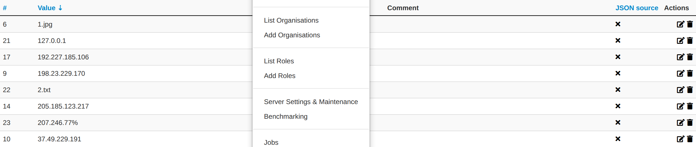

### Correlation rules

Where exclusions suppress a specific value everywhere, **correlation rules**
prevent whole **events** from correlating with one another based on a selector.
A rule matches by creator organisation, owner organisation, event ID, or a
substring of the event info, and stops the selected events from correlating.
Executing a rule can also retroactively remove correlations that already exist
between the matching events. Correlation rules are managed under
**Administration → Correlation rules**.

### Over-correlating values

Some values (for example a very common string) correlate so widely that the
matches become meaningless and expensive to compute. MISP automatically stops
correlating a value once its correlation count exceeds `MISP.correlation_limit`
(default 20). You can review the affected values — and which ones are currently
over-correlating — under **Administration → Over-correlating values**.

### Top correlations

**Administration → Top Correlations** shows a ranked list of the values that
correlate the most. It is a good starting point for finding candidates for
exclusions or over-correlation suppression.

### Correlation engine

The correlation engine is selected with the `MISP.correlation_engine` setting
(Default, NoAcl or OnDemand). On very large instances the *OnDemand* engine
computes correlations only when an event is viewed, trading immediate
correlation for a lower write-time cost.

## Logs

Users with audit permission can browse the actions that MISP records. In 2.5 the
top-menu **Logs** entry groups four views:

*   **Application Logs** — the legacy application log: logins and logouts, failed
    authentication attempts, and a range of application events.
*   **Audit Logs** — the detailed audit trail of data changes (see below); shown
    once the audit log is enabled.
*   **Access Logs** — a per-request HTTP access log (see below); site admins only.
*   **Search Logs** — a filtered search over the application log.

### Audit logs

The audit log records every change to the data model — additions, edits, soft
and hard deletes, tagging, galaxy attachment, publishing, and more — across
events, attributes, objects, users, organisations, roles, servers and dozens of
other models. Crucially it stores the **field-level changes** (old and new
values) for each entry, with secrets such as passwords and API keys redacted.

Enable it with the **`MISP.log_new_audit`** setting (Administration → Server
Settings → MISP tab); the audit index warns you if it is not yet enabled. Browse
it under **Logs → Audit Logs**, filtering by user, organisation, model, action,
event, IP, request type and date. Site admins see everything, organisation admins
see their own organisation, and regular users see only their own actions. The
per-event **View Event History** action is backed by the same audit log.

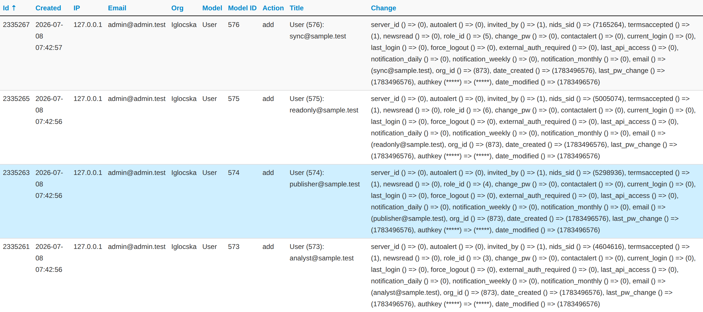

### Access logs

The access log records one row per HTTP request — the user, organisation,
controller/action, URL, response code, duration, memory and query counts, and
(optionally) the client IP, request body and full SQL query log. It is written
when request logging is enabled via **`MISP.log_paranoid`** (all requests),
**`MISP.log_paranoid_api`** (authenticated API requests only), or per-user
monitoring. Related settings control the verbosity —
`MISP.log_client_ip`, `MISP.log_paranoid_include_post_body` and
`MISP.log_paranoid_include_sql_queries`. Browse it under **Logs → Access Logs**
(site admins only), with per-request drill-downs into the stored body and query
log.

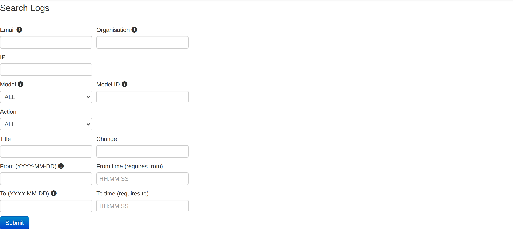


## Background Processing

If enabled, MISP can delegate a lot of the time intensive tasks to the background workers. These will then be executed in sequence, allowing the users of the instance to keep using the system without a hiccup and without having to wait for the process to finish. It also allows for certain tasks to be scheduled and automated.

### Command line tools for the background workers

In MISP 2.5 the background workers run under **SimpleBackgroundJobs** (Supervisor + Redis); the old CakeResque commands no longer apply. The worker processes are controlled by Supervisor:

```bash
sudo supervisorctl status misp-workers:*
sudo supervisorctl restart misp-workers:*
```

To inspect the queues and jobs, use the `Worker` console shell from `/var/www/MISP/app/Console`:

*   **showQueues**: Show the configured queues and how many jobs are waiting in each.
*   **flushQueue [queue]**: Remove all queued jobs from the given queue.
*   **showJobStatus [worker]**: Show the status of the jobs handled by the workers.

```bash
sudo -u www-data /var/www/MISP/app/Console/cake Worker showQueues
```

### Monitoring the Background Processes

The "Jobs" menu item within the Administration menu allows site admins to get an overview of all of the current and past scheduled jobs. Admins can see the status of each job, and what the queued job is trying to do. If a job fails, it will try to set an error message here too. The following columns are shown in the jobs table:

*   **Id**: The job's ID (this is the ID of the job's metadata stored in the default datastore, not to be confused with the process ID stored in the redis database and used by the workers)
*   **Process**: The process's ID.
*   **Worker**: The name of the worker queue. If background jobs are enabled there are 6 queues (default, email, cache, prio, update and scheduler); the scheduler queue should never show up in the jobs table.
*   **Job Type**: The name of the queued job.
*   **Input**: Shows a basic input handled by the job - such as "Event:50" for a publish email alert job for event 50.
*   **Message**: This will show what the job is currently doing or alternatively an error message describing why a job failed.
*   **Org**: The string identifier of the organisation that has scheduled the job.
*   **Status**: The status reported by the worker.
*   **Retries**: Currently unused, it is planned to introduced automatic delayed retries for the background processing and thus add resilience.
*   **Progress**: A progress bar showing how the job is coming along.

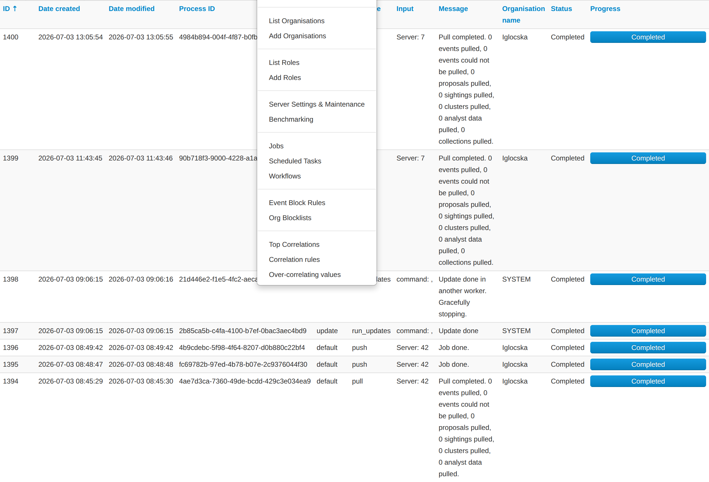

### Scheduling recurring tasks

Site administrators can schedule recurring maintenance tasks under
**Administration → Scheduled Tasks**. In 2.5 this is a reworked, cron-style
scheduler driven by the Supervisor-managed `scheduler` worker (it requires that
worker to be running, or the page shows a warning). You add tasks explicitly
rather than editing a fixed list; the schedulable actions are the JSON/definition
updates: `updateGalaxies`, `updateTaxonomies`, `updateWarningLists`,
`updateNoticeLists` and `updateObjectTemplates`.

Each task row shows its type/action and parameters, the owning user, the
frequency (every N seconds/minutes/hours/days), the last and next run times, the
status of its last job, and an enable/disable toggle. Rows can be forced to run
immediately, edited, deleted, or have their job logs inspected.

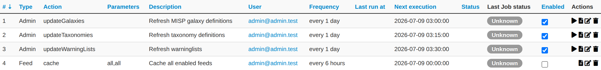

For anything more elaborate, prefer real cron jobs built from the console
commands (see [Automating certain console tasks](#automating-certain-console-tasks)).


## Other 2.5 administration features

MISP 2.5 ships a number of features that administrators configure or manage. Each
is summarised here with where to find it.

### Advanced authentication keys

With the **`Security.advanced_authkeys`** setting enabled, each user can hold
multiple API keys, each with its own comment, expiry and optional IP allowlist.
Keys are stored hashed and are shown only once, at creation — they cannot be
recovered afterwards. Manage them under **Administration → List Auth Keys**.

### Decaying models

Decaying models score how relevant an indicator remains over time. Administrators
create and edit models, and map them to attribute types, under **Global Actions →
List Decaying Models**, and can experiment with the **Decaying Models Tool**. The
*Decaying Model Editor* role permission grants access.

### Workflows

Workflows attach trigger-based automation graphs to MISP events — for example
blocking or enriching an event on publish. They are disabled by default; enable
them with **`Plugin.Workflow_enable`** and manage them under **Administration →
Workflows**.

### Cerebrate

[Cerebrate](https://github.com/cerebrate-project/cerebrate) is a companion
platform for managing organisations and sharing communities. Connect a Cerebrate
node under **Sync Actions → Cerebrates** to pull organisation and sharing-group
definitions into your instance.

### TAXII servers

MISP can push data to TAXII 2.x collections. Configure the server endpoints under
**Sync Actions → TAXII Servers**.

### Dashboards

The **Dashboard** (top menu) is a configurable set of widgets — recent events,
statistics, trends and more — with importable and exportable templates.

### Benchmarking

When enabled with **`Plugin.Benchmarking_enable`**, MISP records per-user and
per-endpoint execution times and query load, viewable under **Administration →
Benchmarking**. It is a diagnostic aid; leave it off during normal operation.


## Various administration tips & tricks


### Setting a Publish Alert Filter

To regulate the reception of e-mail from MISP it is possible to create filters. Each individual user account can apply such filter.

The filter can be configured by the user but also by the organization administrator.

After login goto Administration -> Set User Setting:


A new screen appears. Make sure the “Setting” drop down box shows “publish_alert_filter”:


The text field “Value” contains the filter, which needs to be provided in JSON format. Important JSON-objects which can be used here go by the name AND”, “OR” and “NOT”. These should be structured in a logical tree.

The filtering can be applied to tags, the publishing organization and the threat level. Valid filters:

- AttributeTag.name
- EventTag.name
- Tag.name (checks against both event and attribute tags)
- Orgc.uuid (creator org uuid)
- Orgc.name (creator org name)
- ThreatLevel.name


In the following example, all notifications will be filtered which carry ‘tlp.white’ and ‘tlp.green’ in the name of the tag:

```
{

    "NOT": {

        "Tag.name" : [ "tlp.white", "tlp.green" ]

    }

}
```

The publish_alert_filter setting allows one filter definition to be active.

After applying the configuration, the filter will show up in the “My Settings” menu:


### Default sharing level

Choose your default sharing level to match your usage scenario for MISP. The setting is named *default_event_distribution* and the values can be:

*   Your organisation only (default)
*   This community only
*   Connected communities
*   All communities

You can also set a default distribution level for attributes contained in an event with *default_attribute_distribution*, and it has the same values as the default sharing level for events plus an additional one that allows attributes to inherit the sharing level of the event.

### Adding organisation logos

You can add a logo for your organisations in MISP by uploading them via the tab **Manage files** under the **Administration** menu & **Server Settings** sub-menu.
The filename must be exactly the same as the organisation name that you will use in MISP.
It is recommended to use PNG files of 48x48 pixels.

### The scheduler worker is not starting

Under SimpleBackgroundJobs the scheduler runs as one of the Supervisor-managed workers. If it is not running, check `sudo supervisorctl status misp-workers:*` and the Supervisor logs, and confirm the `SimpleBackgroundJobs` settings (Redis host/port/database and the Supervisor host/port/credentials) under **Administration → Server Settings → Diagnostics**.

### How to redirect HTTP to HTTPS

Here is a sample configuration for Apache webserver.
```
<VirtualHost *:80>
        ServerAdmin misp@misp.misp
        ServerName misp.misp.misp
        ServerAlias misp-int.misp.misp

        Redirect permanent / https://misp.misp.misp

        LogLevel warn
        ErrorLog /var/log/apache2/misp.local_error.log
        CustomLog /var/log/apache2/misp.local_access.log combined
        ServerSignature Off
</VirtualHost>

<VirtualHost *:443>
        ServerAdmin misp@misp.misp
        ServerName misp.misp.misp
        ServerAlias misp-int.misp.misp

        DocumentRoot /var/www/MISP/app/webroot
        <Directory /var/www/MISP/app/webroot>
                Options -Indexes
                AllowOverride all
                Order allow,deny
                allow from all
        </Directory>

        SSLEngine On
        SSLCertificateFile /etc/ssl/misp.misp.misp/misp.crt
        SSLCertificateKeyFile /etc/ssl/misp.misp.misp/misp.key
        SSLCertificateChainFile /etc/ssl/misp.misp.misp/mispCA.crt

        LogLevel warn
        ErrorLog /var/log/apache2/misp.local_error.log
        CustomLog /var/log/apache2/misp.local_access.log combined
        ServerSignature Off
</VirtualHost>
 ```
   Taken from [Koen Van Impe's blog](http://www.vanimpe.eu/2015/05/31/getting-started-misp-malware-information-sharing-platform-threat-sharing-part-3/)

### Increase max size of Samples / other files

Trying to upload a large samples (>50M) might cause the following error:

```
[!] 500 Server Error: Internal Server Error
```

Or will give you an error page in browser.

The error logs on the system will display the following:

```
PHP Warning:  POST Content-Length of 57526024 bytes exceeds the limit of 8388608 bytes in Unknown on line 0, referer: https://XYZ/attributes/add_attachment/1948
```

And / Or

```
PHP Fatal error:  Allowed memory size of 134217728 bytes exhausted (tried to allocate 76705009 bytes) in /var/www/MISP/app/Lib/cakephp/lib/Cake/Network/CakeRequest.php on line 996
```

To fix that you need to adjust the php settings:
```
vi /etc/php/8.3/apache2/php.ini
```

Increase to the following values (or more if you want to)
```
; Maximum size of POST data that PHP will accept.
; Its value may be 0 to disable the limit. It is ignored if POST data reading
; is disabled through enable_post_data_reading.
; http://php.net/post-max-size
post_max_size = 256M
[…]
; Maximum amount of memory a script may consume (128MB)
; http://php.net/memory-limit
memory_limit = 1024M
```

And then restart apache2

```
service apache2 restart
```

### Support & feature requests

The preferred method for support & feature requests is to use the [GitHub ticketing system](https://github.com/MISP/MISP/issues).

If you want to discuss something related to MISP, want some help from the community, etc… You have
the [MISP Users mailing list](https://groups.google.com/forum/#!forum/misp-users) and the [MISP developers mailing list](https://groups.google.com/forum/#!forum/misp-devel).

A number of companies offer custom development, consulting, and support around MISP, please check [the support page of the MISP Project website](http://www.misp-project.org/#support).

### More information in the notification emails about new events

The setting MISP.extended_alert_subject allows you to have an extended subject. One word of warning though. If you’re using encryption : the subject will not be encrypted. Be aware that you might leak some sensitive information this way. Below is an example how the two subject types look like. First with the option disabled, then with the option enabled.
```
Event 7 - Low - TLP Amber
Event 8 - OSINT - Dissecting  XXX… - Low - TLP Amber
```

   Taken from [Koen Van Impe's blog](http://www.vanimpe.eu/2015/05/31/getting-started-misp-malware-information-sharing-platform-threat-sharing-part-3/)

### Get top API users

Per-request data is captured in the **access log** (`access_logs` table) when
request logging is enabled — see [Access logs](#access-logs). The easiest way to
see the busiest API users is **Administration → Access Logs**, filtered by user
and date. To query it directly, for example for the top users over the last day:

```sql
SELECT u.email, COUNT(*) AS requests
FROM access_logs a
JOIN users u ON u.id = a.user_id
WHERE a.created > (NOW() - INTERVAL 1 DAY)
GROUP BY a.user_id
ORDER BY requests DESC;
```

The `ip` column is stored in binary form, so filter on it with
`a.ip = INET6_ATON('203.0.113.5')`. If you only have `MISP.log_auth` enabled
(without the paranoid access log), successful API authentications instead land in
the legacy `logs` table under the `auth` action.

### MISP Logs

By default, MISP has several layers of logs that can be used to trouble-shoot and monitor the system. Let's walk through each of the available logs:

*   **Apache access logs**: Rotating logs generated by apache, logging each request, by default (on Ubuntu) they are found in /var/log/apache2/misp.local\_access.log. The location can be changed via the apache conf file
*   **Apache error logs**: Rotating logs generated by apache, logging error messages, by default (on Ubuntu) they are found in /var/log/apache2/misp.local\_error.log. This error log file will generally not be used by MISP, however, if there is a PHP level error that prevents MISP from functionining you might have relevant entries here.
*   **MISP error log**: Generated by MISP, logging any exceptions that occur during usage. These can be found in /var/www/MISP/app/tmp/logs/error.log (assuming default installation path). If you see errors in here and are stuck with an issue [let us know via GitHub](https://github.com/MISP/MISP/issues/)!
*   **MISP debug log**: Generated by MISP, any debug messages and Notice level messages will be sent to this file. Generally less interesting, but can be helpful during debugging sessions. It should not be necessary to monitor this under normal usage. The file can be found in /var/www/MISP/app/tmp/logs/debug.log (assuming default installation path).
*   **Background worker logs**: Generated by the SimpleBackgroundJobs workers (managed by Supervisor). Job output and worker exceptions are written to /var/www/MISP/app/tmp/logs/misp-workers.log and /var/www/MISP/app/tmp/logs/misp-workers-errors.log. These replace the old CakeResque `resque-*` logs, which are no longer written in MISP 2.5.

### Logging of failed authentication attempts

By default, MISP logs failed login and authentication attempts in the application log. To view them, log in as a site admin and navigate to **Logs → Application Logs** (or **Logs → Search Logs**).

There are two types of entries that will be interesting if you are looking for failed authentication attempts, entries of action "auth\_fail" (for failed attempts to authenticate via the API key or the external authentication system) and login\_fail (for failed login attempts via the login page).

You can also search for any such entries using **Logs → Search Logs**, simply choose the desired action from the two listed above and hit search. (The `Security.log_each_individual_auth_fail` setting controls whether every failure is logged or throttled.)

What is logged:

```
+----------------+------------+---------------------------+----------+
| Auth method    | Action     | Failed credentials logged | IP       |
+----------------+------------+---------------------------+----------+
| Webform        | login_fail | None                      | Optional |
| API            | auth_fail  | API key                   | Optional |
| Webform        | auth_fail  | External auth key         | Optional |
+----------------+------------+---------------------------+----------+
```

In order to enable IP logging for any logged request in MISP, navigate to Administration - Server settings - MISP settings and enable the MISP.log\_client\_ip setting.

It is also possible to enable full logging of API and external authentication requests using the MISP.log\_auth setting in the same location, but keep in mind that this is highly verbose and will log every request made. In addition to the information above, all accessed resource URLs are also logged.

### Clearing expired sessions

By default the garbage collection of sessions is disabled in PHP. It is possible to enable it, but it's not recommended and as such MISP provides a manual way of clearing the sessions.

Navigate to the diagnostics screen of MISP (Administration - Server settings - Diagnostics) and near the bottom of the page there will be a counter showing the count of currently stored expired sessions. Simply purge them by clicking the applicable button when the number grows too large.

### Troubleshooting MISP not connecting to redis but redis-cli working

Make sure the Redis connection settings MISP uses (host, port, database and password under the **MISP** and **SimpleBackgroundJobs** settings) match your running Redis, and that Redis is reachable from the web and CLI users. On an IPv6-enabled host, if `localhost` resolves to the IPv6 loopback (`::1`) first and Redis only listens on IPv4, use an explicit `127.0.0.1` instead. You can confirm reachability with `redis-cli -h 127.0.0.1 -p 6379 ping`.


### Errors about fields or tables

If you have errors with fields or tables that you can see in the error.log or in the page (if you enabled _debug_ or _site_admin_debug_ settings), an easy fix to make most of them go away is to use the **clean cache** feature on the _server settings_ menu, _diagnostics_ tab.
An example of error message:
```
Error: [PDOException] SQLSTATE[42S22]: Column not found: 1054 Unknown column 'Task.job_id' in 'field list'
```

## Jobs

The Jobs tab gives you an overview on any currently running jobs or jobs that were previously completed and their status.


Typically this is one of the places you would turn to even some background process might not complete as expected to get an indication on any issues related to user initiated Jobs.

For ease of use, you can filter the Jobs by queue (All, Default, Prio, Email, Cache).

You can also purge the entries, either only those with a completed status or all of them.
This is not automated and needs to be done manually.

### Scheduled Tasks

The **Scheduled Tasks** page lets you run a small set of definition-update tasks
on a recurring schedule; it is described under
[Scheduling recurring tasks](#scheduling-recurring-tasks) above.

The built-in scheduler is intentionally limited. For anything beyond the handful
of supported update actions, prefer a real scheduler such as your system's
crontab, built from the [console commands](#automating-certain-console-tasks).
As a rule of thumb: if you can click on it, MISP can automate it.

## MISP Backup

Currently there exists this backup script simply called [misp-backup.sh](https://github.com/MISP/MISP/tree/2.5/tools/misp-backup)

All you need is to copy the the sample config and make sure it is correct. Then launch the script.

```bash
cd /var/www/MISP/tools/misp-backup
sudo -u www-data cp misp-backup.conf.sample misp-backup.conf
sudo ./misp-backup.sh
```

Script output:
```bash
/var/www/MISP/tools/misp-backup   2.4 ● $ sudo ./misp-backup.sh
File ./misp-backup.conf exists.
copy of org images and other custom images
MySQL Dump
/var/www/MISP/tools/misp-backup
MISP Backup Completed, OutputDir: /opt/backup
FileName: MISP-Backup-20181128_163215.tar.gz
FullName: /opt/backup/MISP-Backup-20181128_163214.tar.gz
```

## MISP Restore

In a similar fashion you can restore your MISP instance with the **misp-restore.sh** script.
Read the script for details.

## Command line interface (CLI) commands

The below info is also available in the MISP GUI. Go to event actions -> automation -> bottom of the page

### Administering MISP via the CLI

#### Get Setting
    MISP/app/Console/cake Admin getSetting [setting]

#### Set Setting
    MISP/app/Console/cake Admin setSetting [setting] [value]

#### Get Authkey
    MISP/app/Console/cake Admin getAuthkey [email]

#### Reset Authkey
    MISP/app/Console/cake Authkey [email] [api_key | optional]

#### Set Baseurl
    MISP/app/Console/cake Baseurl [baseurl]

#### Change Password
    MISP/app/Console/cake User change_pw [User ID or e-mail address] [new_password] [--no_password_change]
    
If --no_password_change is used, the user will not be required to change their password after their first login with the set password.

#### Clear Bruteforce Entries
    MISP/app/Console/cake Admin clearBruteforce [user_email]

#### Run Database Update
    MISP/app/Console/cake Admin runUpdates

#### Update All JSON Structures
    MISP/app/Console/cake Admin updateJSON

#### Update Galaxy Definitions
    MISP/app/Console/cake Admin updateGalaxies

#### Update Taxonomy Definitions
    MISP/app/Console/cake Admin updateTaxonomies

#### Enable all tags of a taxonomy
    MISP/app/Console/cake Admin enableTaxonomyTags [taxonomy_id]

#### Update Object Templates
    MISP/app/Console/cake Admin updateObjectTemplates

#### Update Warninglists
    MISP/app/Console/cake Admin updateWarningLists

#### Update Noticelists
    MISP/app/Console/cake Admin updateNoticeLists

#### Update MISP
    MISP/app/Console/cake Admin updateMISP

#### Set Default Role
    MISP/app/Console/cake Admin setDefaultRole [role_id]

#### Get IPs For User ID
    MISP/app/Console/cake User user_ips [user_id]

#### Get User ID For User IP
    MISP/app/Console/cake User ip_user [ip]

#### Get / Set The Live State
    MISP/app/Console/cake Admin live [true|false]

With no argument this prints the current live state; passing `false` puts the instance into maintenance mode (blocking logins for non-site-admins).

#### Check Redis Connectivity
    MISP/app/Console/cake Admin redisReady

#### Lint The Configuration
    MISP/app/Console/cake Admin configLint

Reports settings whose current value fails validation.

#### Run Schema Diagnostics
    MISP/app/Console/cake Admin schemaDiagnostics

Reports critical differences between the live database schema and the expected `db_schema.json`.

#### Optimise Database Tables
    MISP/app/Console/cake Admin optimiseTables

#### Run A Security Audit
    MISP/app/Console/cake Admin securityAudit

#### Clean The Caches
    MISP/app/Console/cake Admin cleanCaches

#### Re-encrypt Stored Secrets
    MISP/app/Console/cake Admin reencrypt [--old <key>] [--new <key>]

Re-encrypts stored authentication keys and sensitive settings under a new `Security.encryption_key`.

#### Migrate To Advanced Auth Keys
    MISP/app/Console/cake Admin updateToAdvancedAuthKeys

### Automating certain console tasks
If you would like to automate tasks such as caching feeds or pulling from server instances, you can do it using the following command line tools. Simply execute the given commands via the command line / create cron jobs easily out of them.

#### PullAll
    MISP/app/Console/cake Server pullAll [user_id] [full|update]

#### Pull
    MISP/app/Console/cake Server pull [user_id] [server_id] [full|update]

#### Push
    MISP/app/Console/cake Server push [user_id] [server_id]

#### List Feeds
    MISP/app/Console/cake Server listFeeds

#### Cache Feeds For Quick Lookups
    MISP/app/Console/cake Server cacheFeed [user_id] [feed_id|all|csv|text|misp]

#### Fetch Feeds As Local Data
    MISP/app/Console/cake Server fetchFeed [user_id] [feed_id|all|csv|text|misp]

#### Run Enrichment
    MISP/app/Console/cake Event enrichment [user_id] [event_id] [json_encoded_module_list]

#### Test Server
    MISP/app/Console/cake Server test [server_id]

#### List Servers
    MISP/app/Console/cake Server listServers

### Managing the background workers

Under SimpleBackgroundJobs the worker processes are managed by Supervisor, so the old `Admin startWorker` / `restartWorker` / `restartWorkers` / `killWorker` commands are no-ops — they print *"This method does nothing when SimpleBackgroundJobs are enabled."* Use `supervisorctl` to control the processes and the `Worker` shell to inspect the queues.

#### Control The Worker Processes
    sudo supervisorctl status misp-workers:*
    sudo supervisorctl restart misp-workers:*

#### Show Queues
    MISP/app/Console/cake Worker showQueues

#### Flush A Queue
    MISP/app/Console/cake Worker flushQueue [queue_name]

#### Show Job Status
    MISP/app/Console/cake Worker showJobStatus [worker]

#### List Workers
    MISP/app/Console/cake Admin getWorkers [all|dead]
    
## Administration of TOTP/HOTP
MISP 2.4.172 introduced multi-factor authentication (TOTP/HOTP) support.

Before using or testing this feature, please note that it is extremely important to make sure your server has correct time syncing set up, since the TOTP tokens are time based. If you are alread using e-mail OTP, you can leave this on. The two multi-factor authentication methods can co-exist, users that have TOTP/HOTP set up, will no longer be able to use e-mail OTP. Those that do not have it set, will still be prompted for it in that case.

After updating your MISP, make sure you have installed the required php dependencies by using the top menu to go to Administration > Server Settings & Maintenance > Diagnostics.


If you do not have them installed yet, you can run the equivalent of the below command for your setup / OS to install them:

    sudo -u www-data sh -c "cd /var/www/MISP/app;php composer.phar update"
    
You can see which users have TOTP/HOTP configured in the users index:


As a site admin or org admin (users can't do this themselves), you can delete TOTP/HOTP for a user from the view user page, by clicking the TOTP Delete button.


### Mandating TOTP/HOTP usage
You can mandate the usage of TOTP/HOTP by setting the Security.otp_required setting to true. Users will then be prompted to set up TOTP/HOTP when trying to access a page, if they haven't done so yet.

From the command line you can run the equivalent of the below command for your setup, to configure this:

    sudo -u www-data /var/www/MISP/app/Console/cake Admin setSetting Security.otp_required true
    
### Transitioning from e-mail OTP to TOTP/HOTP
If you are currently using e-mail OTP on your instance, you have the option to enable TOTP/HOTP (by installing the required php dependencies) and giving your users a transition period to set up their TOTP (e-mail OTP will still work during this period), before mandating TOTP.

### How to use TOTP/HOTP
For information on how to use this feature from a normal user perspective, please refer to the [using the system](../using-the-system/index.qmd) section.

