In information sharing, the privacy of the reporting organization can be important in cases such as:

- when an incident should not be linked to a potential victim.
- when you want to avoid linking a specific organization to the shared information.

MISP includes a delegation feature that lets another organization publish an event on your behalf and removes the direct link between the shared information and your organization.
If you want to publish an event without your organization being tied to it, you can delegate publication to another organization.
That organization becomes the owner of the event.
You can delegate only to local target organizations, not to remote ones.

::: {.callout-warning}
You need a role with `Delegation access` to delegate an event.
:::
::: {.callout-warning}
You must also enable the `MISP.delegation` parameter on your instance.
:::

### Send a delegation request

To do this, you first need to set the event distribution to **Your organization only**.
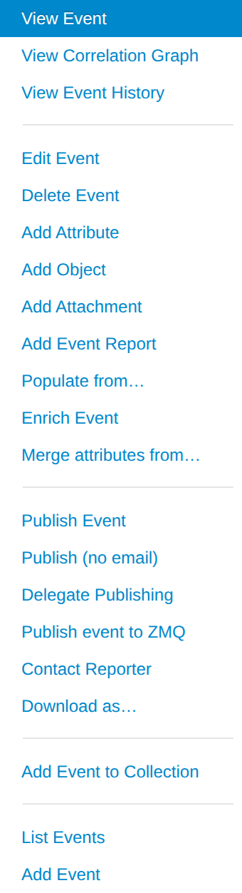
Otherwise, the delegation option will not be available.
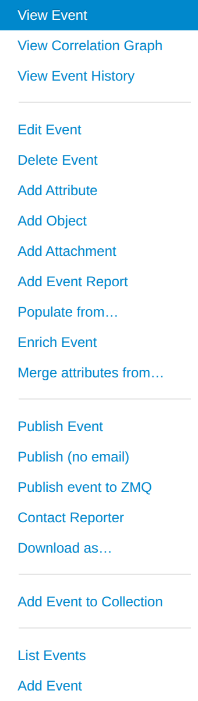

::: {.callout-note}
The "distribution must be *Your organization only*" restriction is lifted if the site
administrator has enabled the `MISP.unpublishedprivate` setting on the instance. When that
setting is on, an event with any distribution level can be delegated.
:::

An event can only have **one pending delegation request at a time**. If you need to change
the target organization or the requested distribution, discard the existing request first,
then create a new one.

When you click **Delegate Publishing**, a pop-up appears.
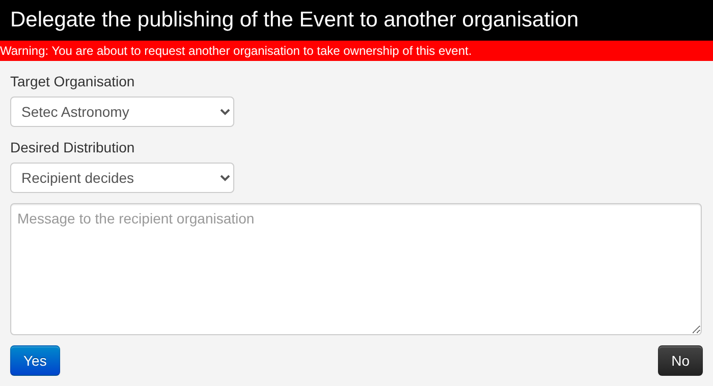
Here you can choose the following options:
- The organization to which you want to delegate the event.
  In this example, we ask Setec Astronomy to publish the event for us.
- The distribution option you would like to request for the event.
  You can let the recipient organization choose if you do not mind.
  In this example, we request **All communities**, but this is only a suggestion and the recipient can still change the distribution later.
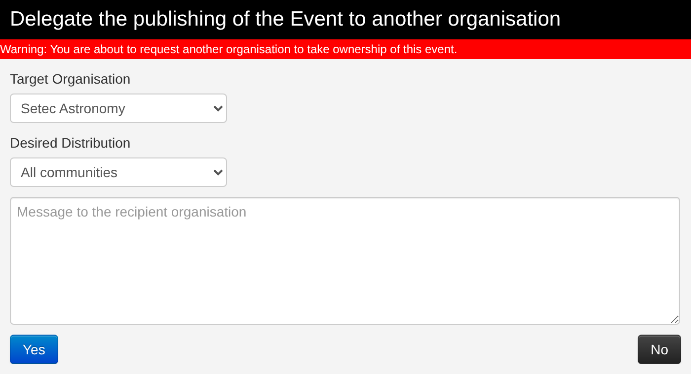
- An optional free-form message to the recipient organization.
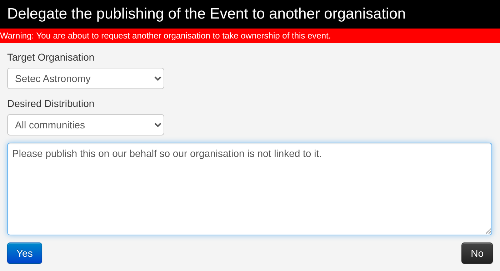

Once the request is sent, a message appears on the event to remind you that the request is pending.

You can also view more details by clicking **View request details**.
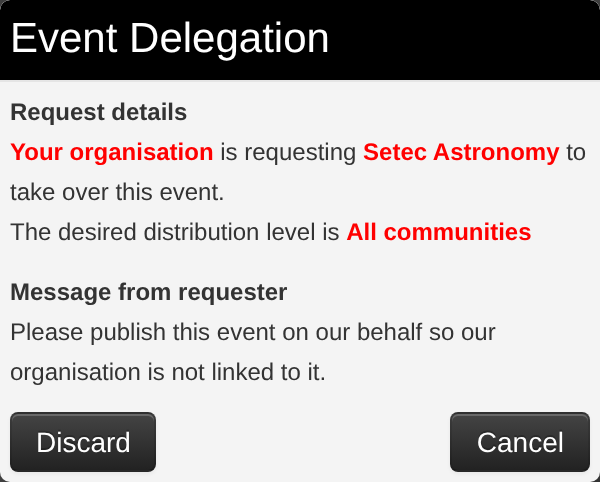
You can discard the request yourself by using either this pop-up or the link in the left-side menu.

Both the requesting and the recipient organization can review pending delegations at any time
from the top navigation bar under **Global Actions → View delegation requests** (labelled
*Delegation Requests*), which lists every request awaiting action.

### Answer a delegation request

As the recipient organization, you receive the delegation request.
You are notified by a red circle around the envelope in the upper-right corner of the screen.

When you click it, you are redirected to the dashboard, where the delegation request appears in the left pane.

Click **View** to open an event list showing all events that other organizations want to delegate to your organization.
In this example, we see a single event from Acme Factory.
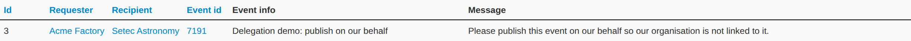
Here are the metadata for that event.
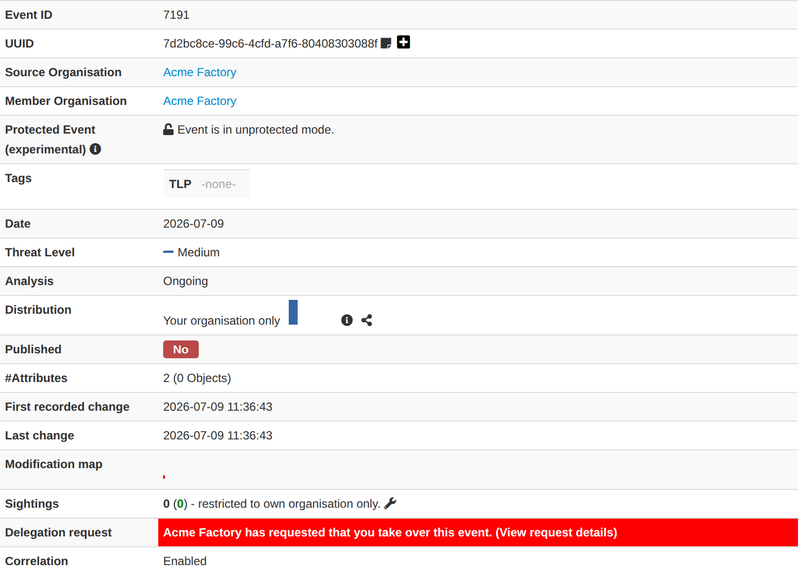
You can view the full details by clicking the corresponding link.
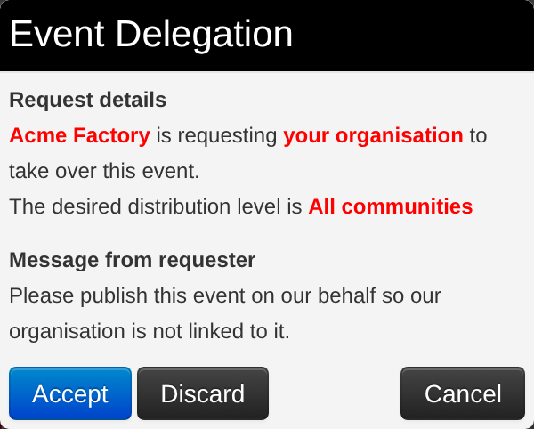
If your role includes publishing rights, you can manage the delegation request by using one of the two links in the left-side menu.
You can either discard it:
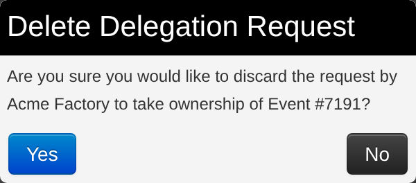
Or accept it:
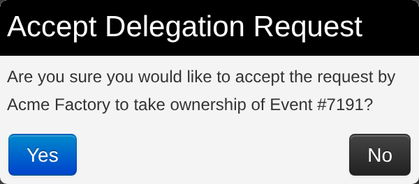
Note that the distribution requested by the original sender is not applied automatically.
If the setting is not changed, the event remains distributed only to your own organization.
