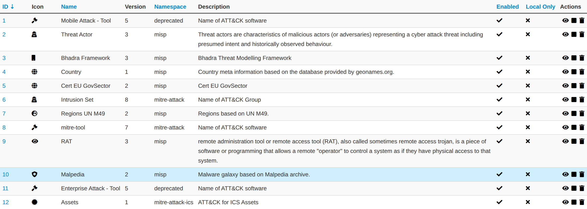
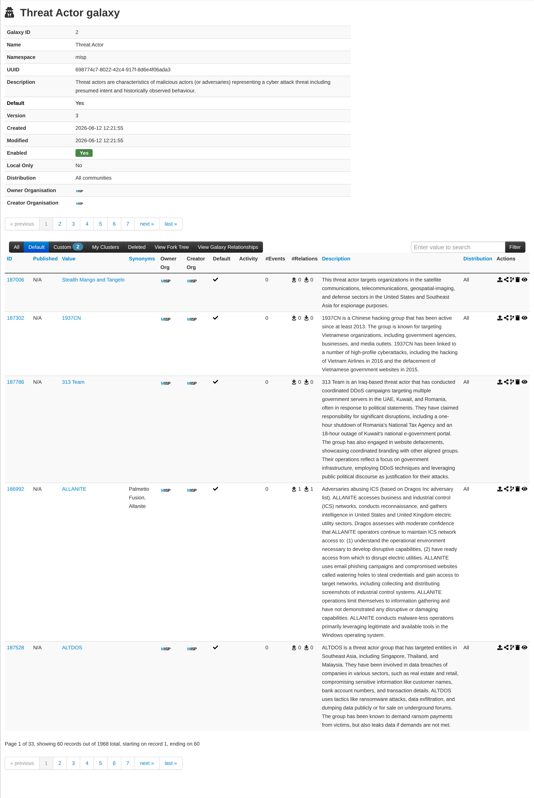
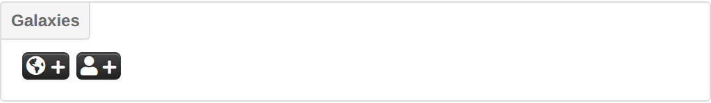
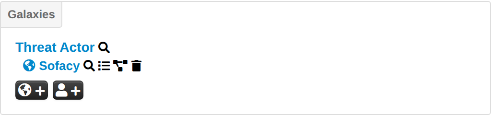

Galaxies are MISP's way of attaching rich, structured knowledge objects —
**clusters** — to events and attributes. A cluster is a named entry (a threat
actor, a malware family, an ATT&CK technique, a sector, a country, …) carrying a
description, synonyms, and a set of key/value metadata. Where a plain tag gives
you one label and one colour, a galaxy cluster gives you a whole reusable object
with context and relationships.

MISP ships with a large library of community-maintained galaxies (from
[misp-galaxy](https://github.com/MISP/misp-galaxy), and drawing on standards such
as [ATT&CK](https://attack.mitre.org/), STIX and others). You can use these
default clusters as they are, and — since "Galaxy 2.0" — create, edit, fork and
relate **your own** clusters directly in the web interface. Each cluster carries a
MISP distribution level, so custom knowledge can be kept local or shared as
widely as you like.

Under the hood a galaxy cluster is stored as a tag of the form
`misp-galaxy:<type>="<uuid>"`, which is what actually gets attached to an event
or attribute — but the UI presents it as a first-class object rather than a flat
tag. For the difference between galaxies and taxonomy tags, see the
[Taxonomies](../taxonomy/index.qmd) chapter.

## Managing galaxies in the UI

Open **Galaxies** from the top menu to see every galaxy on the instance.

The index lists each galaxy with its icon, name, version, namespace and
description, and shows whether it is **enabled** and whether it is **local only**.
Use the *All / Enabled / Disabled* tabs and the search box to filter.

Each galaxy can be opened with the **View** action. The galaxy page shows its
metadata (namespace, UUID, distribution, owner and creator organisation, whether
it is a default galaxy, and its kill-chain layout for matrix galaxies) and, below
it, the list of its clusters.

The cluster list has its own context tabs — **All**, **Default** (shipped
clusters), **Custom** (clusters created on this instance), **My Clusters**,
**Deleted**, **View Fork Tree** and **View Galaxy Relationships** — and, for each
cluster, an activity sparkline (from sightings) alongside the number of events
and relationships it appears in.

### Enabling, disabling and updating galaxies

Site admins can **enable** or **disable** a whole galaxy from the index (a
disabled galaxy is hidden from the attach picker). The bundled galaxy library is
refreshed from the misp-galaxy files on disk with the side-menu actions:

*   **Update Galaxies** — reimport all galaxies from the library, adding new
    default clusters and relationships.
*   **Force Update Galaxies** — drop and reimport, useful when a definition
    changed in place.
*   **Wipe Default Galaxy Clusters** — remove all shipped clusters (custom
    clusters are kept).

The same reimport is available on the command line with
`cake Admin updateGalaxies [force]`, which is convenient for a cron job (see the
[administration](../administration/index.qmd) chapter). The library files
themselves are updated by pulling the misp-galaxy submodule (part of the standard
`git submodule` update during a MISP upgrade).

### Matrix galaxies

Galaxies that define a `kill_chain_order` — most notably the MITRE ATT&CK
galaxies — are rendered as an interactive **matrix**, with the techniques present
in an event highlighted as a heat-map across the tactics.

## Using galaxies in events and attributes

Galaxy clusters are attached from the **Galaxies** panel on an event (or on an
individual attribute). The panel offers two add buttons: **Add new cluster**
(global — the cluster is shared and synchronised with the event) and **Add new
local cluster** (the attachment stays on your instance only). Local attachments
are useful for adding your own context to data you intend to share without
leaking that context.

Clicking either button opens a picker where you first choose a galaxy (or search
across all of them), then select one or more clusters to attach.

Clusters carry synonyms, so if you cannot find an actor or family under the name
you know, search for it — an alias will lead you to the canonical cluster. In the
example below, searching for "Sneaky Panda" surfaces the cluster under its
primary name.

Once attached, each cluster in the Galaxies panel offers inline actions: a
magnifier to **view the cluster**, an icon to **list the events** that use it, a
control to **modify the tag relationship**, and a trash icon to **detach** it. A
globe or user icon indicates whether the attachment is global or local.

## Creating your own galaxy clusters (Galaxy 2.0)

Users with the **Galaxy Editor** role permission (or site admins) can create
custom clusters directly in the UI. Default (shipped) clusters are read-only;
your custom clusters are owned by your organisation and are fully editable.

From a galaxy's view, use **Add Cluster** to open the cluster form:

*   **Name** — the cluster's value (for example the actor or family name).
*   **Distribution** / **Sharing Group** — who the cluster is shared with, using
    the standard MISP distribution levels (Your organisation only → All
    communities, or a sharing group).
*   **Description** — free text describing the cluster.
*   **Authors** — a JSON array or comma-separated list of authors.
*   **Source** — where the information comes from.
*   **Galaxy Cluster Elements** — the key/value metadata (synonyms, references,
    external IDs, and any other fields). You can paste a JSON array of
    `{key, value}` objects, or use the **Toggle UI** button to fill in the
    key/value pairs through a form.

You can also create an entirely new **custom galaxy** to hold your clusters with
**Add Custom Galaxy** (from the galaxies index side menu) — for example a galaxy
specific to your organisation's internal taxonomy of adversaries.

### Publishing custom clusters

A custom cluster must be **published** before it can be attached to data or
synchronised — an unpublished cluster is hidden from the attach picker, and the
cluster view warns you that users cannot yet use it. Publishing requires both the
*Galaxy Editor* and *Publish* permissions. Note that editing a cluster (or
changing one of its relationships) automatically un-publishes it, so you republish
when your changes are ready. Published clusters are pushed to the sync servers you
are connected to, according to their distribution level.

## Forking a cluster

Sometimes you want to build on a shipped cluster without losing the link to the
original — for example to add your own metadata or relationships to a MITRE
technique. **Forking** creates an editable copy of any cluster in the same
galaxy: use the **Fork** action on a cluster row (or *Fork Cluster* in the cluster
menu).

The fork is a new, independent custom cluster owned by your organisation, with its
own UUID, but it records the parent it was forked from. The cluster view shows
**Forked From** / **Forked By** links, and when the parent later advances to a
newer version you get a **New version available** banner with the option to pull
the parent's changes into your fork.

## Cluster relationships

Clusters can be linked to one another to build a graph of related knowledge — for
example marking one actor as *is-similar* to another, or a malware family as
*used-by* an actor. A relationship connects a **source** cluster to a **target**
cluster with a **relationship type** (a free-form string; the picker suggests
existing types such as `is-similar`), can carry its own **tags** (for example
estimative-language or false-positive tags to qualify the link), and has its own
distribution level.

Add relationships from a cluster's **View Galaxy Relationships** panel using the
inline **Add relationship** form (the source is pre-filled; pick a type, choose
the target cluster, and optionally add tags), or from the dedicated relationship
add form. The panel offers both a **tree** and a **tabular** view, with an option
to include inbound relations. Because a relationship is part of the cluster's
shared data, adding, editing or deleting one un-publishes the source cluster until
you republish.

## Blocklisting galaxy clusters

If you want to keep a specific cluster from ever being captured or synchronised
onto your instance, add its UUID to the **galaxy cluster blocklist** (List Cluster
Blocklists in the galaxies menu; hard-deleting a cluster also adds it to the
blocklist). See [Blocklists](../administration/index.qmd#galaxy-cluster-blocklist)
in the administration chapter.

## Authoring galaxies as JSON

The UI editor is the recommended way to build clusters on a running instance.
If instead you want to author galaxies as JSON files — for example to contribute
them back to the community [misp-galaxy](https://github.com/MISP/misp-galaxy)
repository — a galaxy is made up of two paired files that share the same `type`
and `uuid`:

*   a **galaxy definition** (`galaxies/<type>.json`) — metadata: name,
    description, icon, namespace, and (for matrix galaxies) the `kill_chain_order`
    that lays out the matrix columns; and
*   a **cluster collection** (`clusters/<type>.json`) — the actual clusters, each
    with a value, description, and `meta` key/values (and, for matrix galaxies, a
    `kill_chain` entry per value that places it in the matrix).

Rather than hand-editing and validating these files, use the **MISP Galaxy
Editor**, part of the
[MISP Engineering Bay](https://github.com/MISP/misp-engineering-bay) toolset. It
is a small self-hosted web application that provides a guided editor for both
simple and matrix galaxies: a unified galaxy-and-cluster editor, a drag-and-drop
matrix builder, autocomplete for the common meta keys, a relationship editor,
real-time validation with a live JSON preview, and one-click export of a zip that
matches the misp-galaxy repository layout (`galaxies/` + `clusters/`). Once you
have your files, drop them into `app/files/misp-galaxy/` and run **Update
Galaxies** (or `cake Admin updateGalaxies force`) to load them.

## Available galaxies

The set of bundled galaxies changes with every misp-galaxy release, so this
chapter does not reproduce the list. To see exactly what is available on your
instance, browse **Galaxies** in the UI; for the authoritative, always-current
catalogue see the [misp-galaxy](https://github.com/MISP/misp-galaxy) repository
and the [MISP galaxy page](https://www.misp-project.org/galaxy.html).
