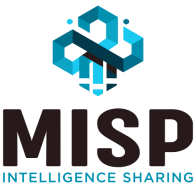

{width=220 fig-align="left"}

This guide introduces MISP, the MISP Intelligence Sharing Platform — an open source platform for sharing threat intelligence.
It is intended for ICT professionals such as security analysts, incident responders, and malware reverse engineers who share threat intelligence with MISP or integrate MISP into other security monitoring tools.
The guide covers day-to-day use of the MISP graphical user interface together with its automated interfaces (API) so that teams can integrate MISP into their security environment and operate one or more MISP instances.
It is maintained against the current **MISP 2.5.x** release series; where behaviour differs from earlier versions this is called out in the relevant chapter.

## Acknowledgement

The MISP user guide is a collaborative effort involving contributors to [MISP](https://www.github.com/MISP), including:

* Belgian Ministry of Defence \(CERT\)
* [CIRCL Computer Incident Response Center Luxembourg](https://www.circl.lu/)
* Iklody IT Solutions
* [NATO NCIRC](http://www.ncirc.nato.int/)
* Cthulhu Solutions
* [CERT-EU](https://cert.europa.eu)

and many other contributors, especially those who participated in the [MISP hackathons](https://github.com/MISP/MISP/wiki/Hackathon "MISP Hackathon Wiki").

## Contributing

We welcome contributions to the MISP book.
If you want to contribute, see our [contributing guide](https://github.com/MISP/misp-book/blob/main/CONTRIBUTING.md).



## Format

The MISP book is available in [HTML](https://www.circl.lu/doc/misp/), [PDF](https://www.circl.lu/doc/misp/book.pdf), and [ePub](https://www.circl.lu/doc/misp/book.epub).

## License

The MISP user guide is dual-licensed under [GNU Affero General Public License version 3](http://www.gnu.org/licenses/agpl-3.0.html) and [CC-BY-SA 4.0 international](https://creativecommons.org/licenses/by-sa/4.0/).

* Copyright \(C\) 2012 Christophe Vandeplas
* Copyright \(C\) 2012 Belgian Defence
* Copyright \(C\) 2012 NATO / NCIRC
* Copyright \(C\) 2013-2026 Andras Iklody
* Copyright \(C\) 2015-2026 Alexandre Dulaunoy
* Copyright \(C\) 2014-2026 CIRCL - Computer Incident Response Center Luxembourg
* Copyright \(C\) 2018 Camille Schneider
* Copyright \(C\) 2018-2026 Steve Clement
* Copyright \(C\) 2021 Jeroen Pinoy
