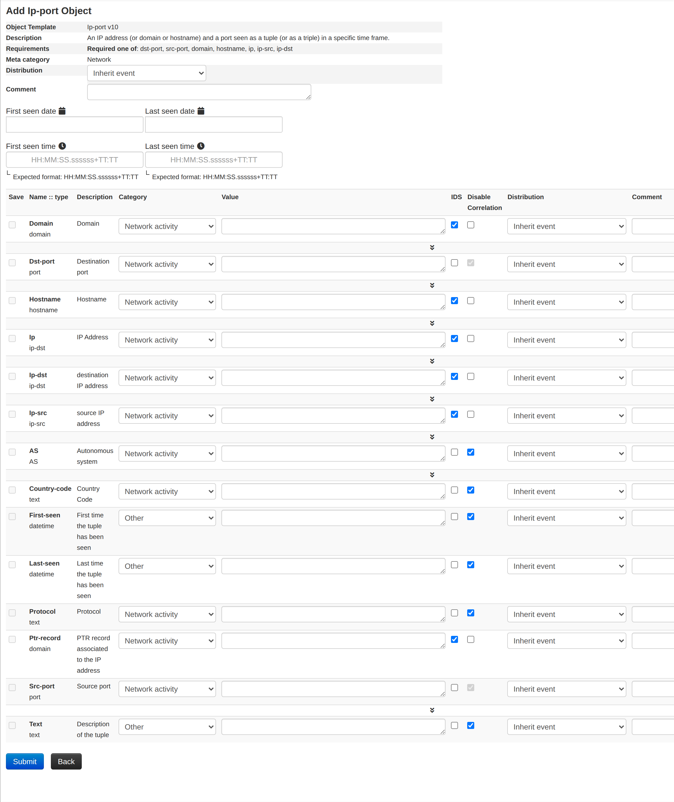

A **MISP object** is a structured group of related attributes, built from a
reusable **template** — for example a `file` object bundling a filename with its
hashes and size, or a `domain-ip` object. Objects sit alongside plain attributes
and let you express richer, real-world constructs while keeping each value a
first-class, correlatable attribute. The object templates are community-maintained
in the [misp-objects](https://github.com/MISP/misp-objects) repository and are
designed around real cyber-security use-cases and sharing practices.

## Using objects

Objects can be added by using the side menu:  

This will open a popup where you can choose the type of object:  
  
If there are only few templates available for this type, they will all be shown this way:

Otherwise you will be able to search and select the desired object within a scrolling list (a search field is available)
 
A description of each object is shown by hovering the info icon or directly besides it.

For this example we will try to add an ip|port object:

For some objects, there might be attributes that required to be set. For instance in this object, there is a required attribute, "Ip", and it is also required to set one of the attributes between "dst-port" and "src-port". If these requirements are not met, the object will not be valid and therefore not added to the event. Also you can't add an object without setting any attribute.   

After pressing "Submit, you are given the possibility to review your object before saving it.

Objects can also be created for you by the [import tools](../using-the-system/index.qmd#populate-from) (freetext and the various "Populate from…" formats), which build the appropriate objects from the data you paste in.

## Object references and relationships

The real power of objects comes from linking them together. An object can hold
**references** to other objects — or to individual attributes — each labelled with
a **relationship type** that says *how* they are related (for example a
`network-connection` object *`connects-to`* an `ip-port` object, or a `file`
object was *`downloaded-from`* a `url`). Together these references form the
**event graph** you can explore from the event view.

To add one, use the **Add reference** action on an object and pick the target
object or attribute plus a relationship type. MISP offers a standard set of
relationship types (maintained in the misp-objects repository), or you can enter
a custom one. References are directional (source → target) and are shown both on
the objects themselves and in the event graph.

## Editing objects

An object's attributes are edited just like any other attribute — inline in the
event view, or through the object's edit form. As with attributes, changing an
object un-publishes the event, so you republish once you are done.

## Object templates

Every object is created from an **object template** that defines which attributes
it can contain, which are required, and how they are presented. The template
library ships with MISP and is kept up to date from the
[misp-objects](https://github.com/MISP/misp-objects) repository — refresh it with
**Update Objects** in the administration menu, or on the command line with
`cake Admin updateObjectTemplates` (a good candidate for a cron job).

### Creating object templates

An object template is a JSON file that follows the
[object schema](https://github.com/MISP/misp-objects/blob/main/schema_objects.json).

An object is basically a combination of two or more attributes that can be used together to represent real cyber security use-cases. These attributes are listed in a JSON object.

Each attribute is an JSON object defined by a name, a description, a misp-attribute and an ui-priority value.
- Name and description are self-explanatory.
- misp-attribute is an existing type of attribute in misp that matches the attribute.
- Concerning ui-priority, the higher the number is, the most it is expected to be seen.

There are also others options that can be added to define an attribute more precisely.
- sane_default is a list of default valid value for this attribute. The user can pick a value from this list or choose "Enter value manually"
- disable_correlation will disable correlation for this value. Useful for dates for instance
- recommended value for this field
- multiple, if set to true, allow the user to add multiple instances of this attribute.

Not all attributes are mandatory, but some can be required. If so, they need to be listed in a list called "required". The object will only be valid if the listed attributes are set.
The same way, there are sometimes when only one attribute in a set is needed. This set can be put in a list called "requiredOneOf". If at least one of the attributes in this list is set, the object will be valid.

Rather than hand-editing and validating these JSON files, you can use the
**Object Template Creator**, part of the
[MISP Engineering Bay](https://github.com/MISP/misp-engineering-bay) toolset. It
is a small self-hosted web application that provides a guided editor for object
templates — a searchable attribute-type picker driven by MISP's `describeTypes`,
real-time validation, and import/export of `definition.json` files — and can load
any of the existing templates as a starting point. Once your template is ready,
add it to `app/files/misp-objects/` and run **Update Objects** (or
`cake Admin updateObjectTemplates`) to load it.
