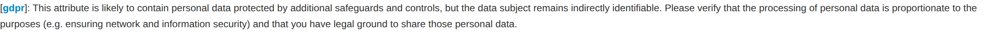
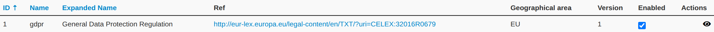

[]{#misp-noticelist}

Notice lists inform MISP users about the legal, privacy, policy or technical
implications of using specific attributes, categories or objects. They are a way
for a community to attach guidance to particular kinds of data — for example
reminding users of a handling requirement when they add an attribute that matches
a sensitive pattern.

## How notices are triggered

Each notice list is a simple JSON description that pairs a set of triggers (by
attribute type, category, object, or value pattern) with an informational
message. When you enter or edit data that matches an active notice list — for
example while adding an attribute — MISP shows the corresponding notice inline on
the form, so you are made aware of the implication before you save. Notices are
purely informational: they warn and inform, they do not block the action.

## Managing notice lists

Notice lists are managed from the administration menu:

*   **List Noticelists** shows every notice list on the instance, whether it is
    enabled, and its contents. Only enabled notice lists produce notices.
*   **Enable / disable** a notice list to control whether it is active.
*   **Update Noticelists** re-imports the bundled notice lists from the
    [misp-noticelist](https://github.com/MISP/misp-noticelist) library. The same
    update is available on the command line with
    `cake Admin updateNoticeLists` (handy for a cron job — see the
    [administration](../administration/index.qmd) chapter).

The set of notice lists is maintained by the community in the
[MISP notice list repository](https://github.com/MISP/misp-noticelist); you can
contribute new ones there, or add your own locally.
