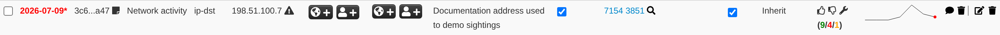
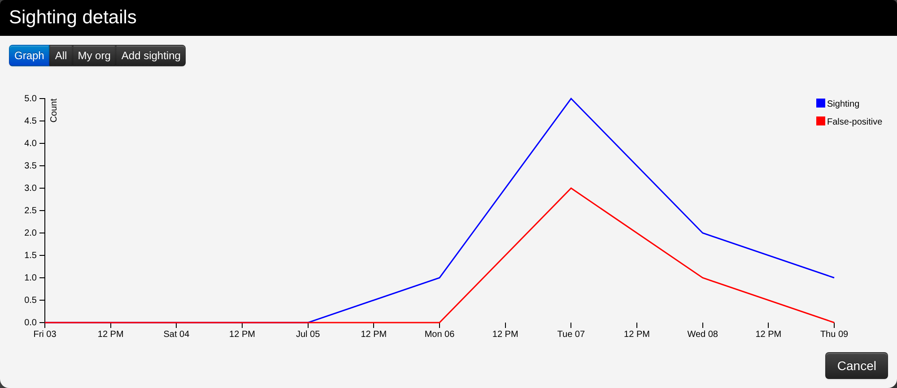
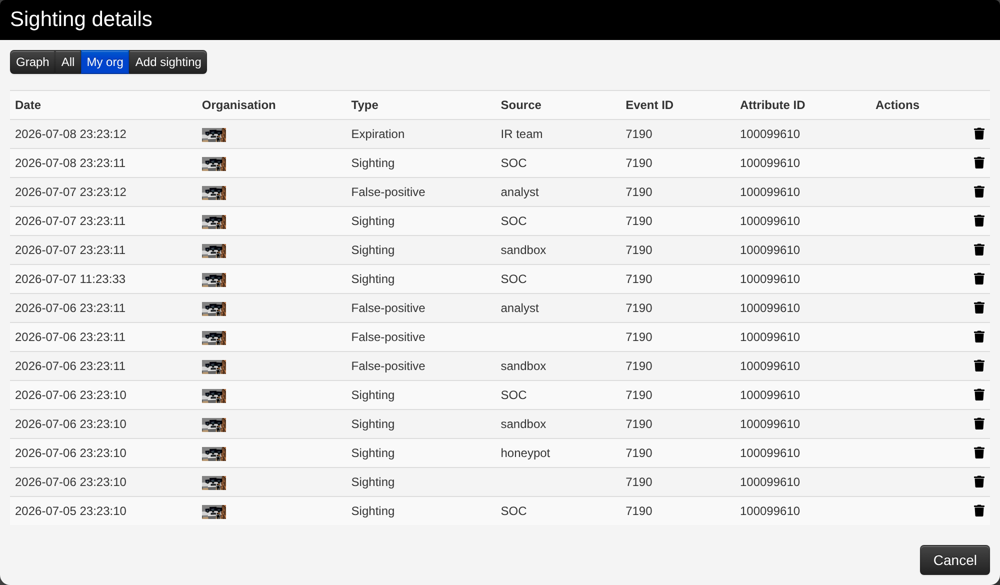
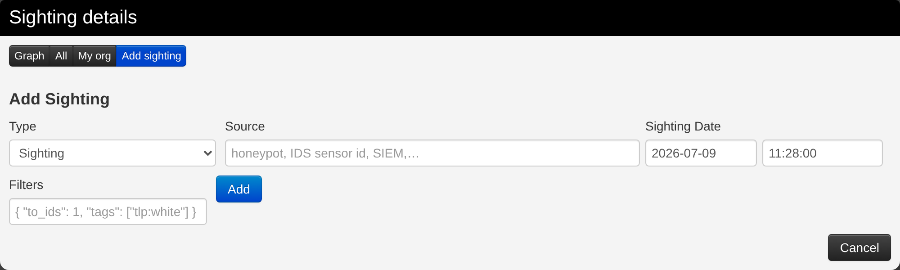
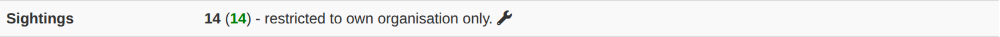
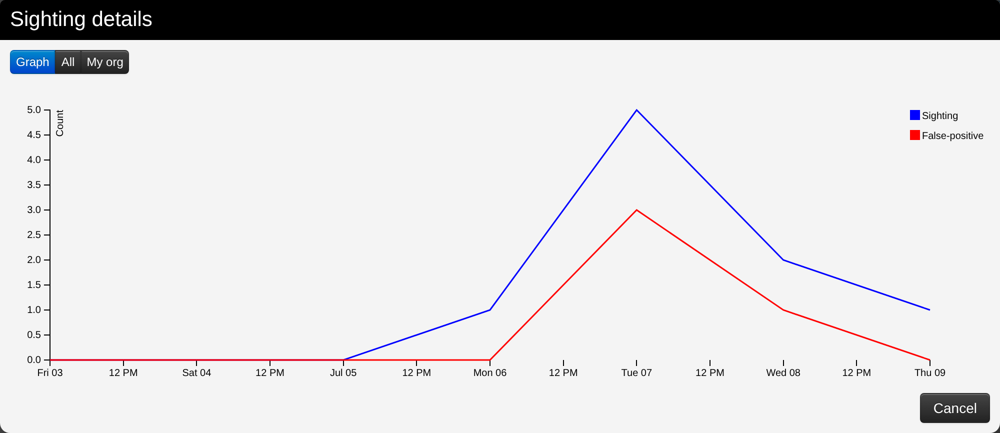

Basically, sighting is a system allowing people to react on attributes on an event. It was originally designed to provide an easy method for user to tell when they see a given attribute, giving it more credibility.

Now sightings have been improved to also provide a method to signal false positives, but also to give an expiration date for some attributes.

### Explanation

As said before, Sighting is a way for a user to say that they have seen or notice an attribute and confirm its validity. An attribute can been spotted several times by the same user, that is why a single user can use sighting several times on a single attribute.

Sometimes, some attributes can be considered as false positives, even if the false positive list do not detect them (for instance, if the IDS flag is set to false) so they can also be notified. As well as concerning sighting, the same user can signal a single attribute as a false positive several times.

It also happens that some attributes are only valid a certain time (for instance, in case of a phishing campaign that is assumed to be up for only one week). In this case, people can also assign an expiration date to an attribute, but this time, there can be only one valid expiration date per *organisation*.

### Using sightings on an event (GUI)

Sighting is applied to every attribute, under the column "Sightings", easily identifiable with its colored number. This column shows three icons and three values.

These three values show respectively:
- The number of true positives detected with the attribute, in green. Malicious activity as described in the event.
- The number of times the attribute has been marked as false positive, in red. Non-malicious activity or incorrect detection.
- The number of different expiration dates that have been affected on this attribute, in orange

Concerning the three icons:
- The first one (Thumb up) allows to add a sighting (true positive) on an attribute.
- The second one (Thumb down) allows to mark the attribute as a false positive.
- The third one (Tool) opens a popup for advanced sightings, showing sightings details and allowing different actions.

#### Advanced sightings

- The first tab, "Graph", represents a line graph showing the evolution of sightings and false positives over time.

- The second tab gives a quick view of all the sightings applied to the attribute.

- The third tab gives a quick view of the sightings applied to the attribute by your own organisation only.

- The last tab can be used to add either a sighting, mark the attribute as a false positive, or define an expiration date. You can precise both the date and time of day, as well as note a particular source where the sighting comes from.

#### At Event level

The total number of sightings is also visible as part of the metadata in front of the Sightings label, as well as a sparkline graph that summarize the evolution of sightings.  

Clicking on the tool will show sighting details for the whole event.

### Sighting policies and privacy

Because sightings reveal who is looking at which indicators, MISP gives
administrators several controls over how much of that is shared (all under
Administration → Server Settings):

*   **Sightings_policy** — who can see the reported sightings on an event: the
    event-owner organisation only (the default; everyone always sees their own
    contribution), the *sighting reporters* (the owner plus any organisation that
    contributed a sighting), or *everyone* who can see the event.
*   **Sightings_anonymise** — strip the reporting organisation from sightings so
    consumers see the counts but not who reported them.
*   **Sightings_anonymise_as** — when pushing sightings to other servers, report
    them all as a single organisation, hiding the individual reporters on this
    instance behind one identity.
*   **Sightings_range** — how many days back a sighting is considered relevant
    (default 365).

### SightingDB

For high-volume sighting data, MISP can offload sightings to one or more external
**SightingDB** servers instead of storing every sighting in the main database.
Enable it with `Sightings_sighting_db_enable` and configure the SightingDB
servers from the administration menu; matching attributes then gain an additional
SightingDB column in the event view.

### Real-time sharing and blocklists

*   With `Sightings_enable_realtime_publish` set, new sightings are pushed to your
    sync partners as they are created, rather than only when the event is
    (re)published. You can also push sighting updates on demand with **Publish
    Sightings** in the event menu.
*   To ignore sightings from a specific organisation (for example a noisy source),
    add it to the **sighting blocklist** — see
    [Blocklists](../administration/index.qmd#sighting-blocklist) in the
    administration chapter.

### Using sightings on an event (API)

Please have a look at the [automation API](../automation/index.qmd#sightings-api)
