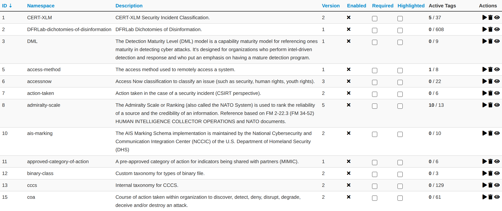
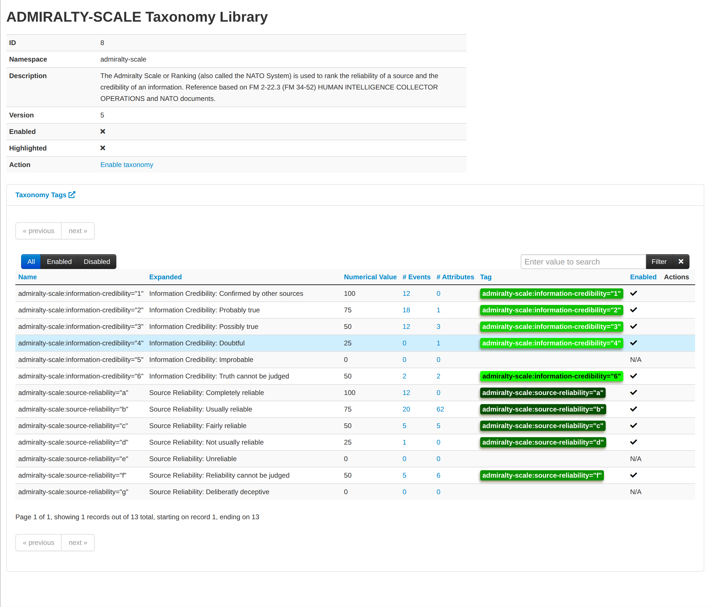
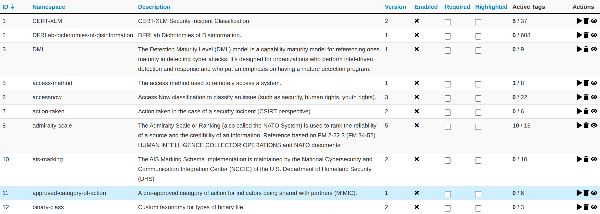
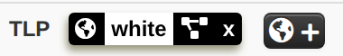
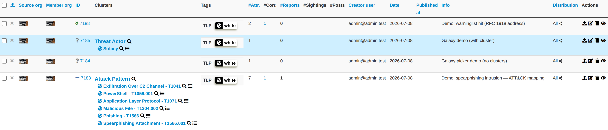
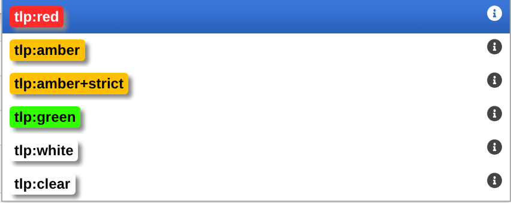
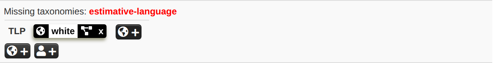

MISP supports a flexible mechanism for [taxonomies of classification](https://github.com/MISP/misp-taxonomies) — curated sets of machine tags you can enable, cherry-pick, and share across instances.

You can access the taxonomy by going into 'Event Actions' and select 'List Taxonomies'. For fresh install, make sure to click 'Update Taxonomies' to view available taxonomies.

A [complete list of the available taxonomies](https://www.misp-project.org/taxonomies.html) [PDF](https://www.misp-project.org/taxonomies.pdf) are available on the MISP project website.

Taxonomies can be used in MISP (as local or distributed tags) or in other tools willing to share common taxonomies among security information sharing tools.

MISP ships **166 taxonomies** in 2.5.42 and the catalogue grows regularly, so this guide no longer reproduces the full list. Browse the always-current, authoritative catalogue on the [MISP taxonomies page](https://www.misp-project.org/taxonomies.html) ([PDF](https://www.misp-project.org/taxonomies.pdf)), or in your own instance under **Event Actions → List Taxonomies** (on a fresh install, click **Update Taxonomies** first). Widely used examples include [TLP](https://github.com/MISP/misp-taxonomies/tree/main/tlp), [PAP](https://github.com/MISP/misp-taxonomies/tree/main/PAP), [Admiralty Scale](https://github.com/MISP/misp-taxonomies/tree/main/admiralty-scale), [Estimative Language](https://github.com/MISP/misp-taxonomies/tree/main/estimative-language) and the [MISP](https://github.com/MISP/misp-taxonomies/tree/main/misp) taxonomy.

A taxonomy contains a series of tags that can be used as normal tags in your MISP instance.

Tagging is a simple way to attach a classification to an event. In the early version of MISP, tagging was local to an instance. Classification must be globally used to be efficient. After evaluating different solutions of classification, we build a new scheme using the concept of machine tags.

Taxonomy is a classification of informations. Taxonomies are implemented in a simple JSON format. Anyone can create their own taxonomy or reuse an existing one.

Taxonomies are in an [independent git repository](https://github.com/MISP/misp-taxonomies).

These can be **freely reused** and **integrated** in other threat intel tools.

The advantage is that you can set a specific tag as being
exportable. This means that you can **export** your classification with other MISP instance and **share** the same taxonomies. Tagging is a simple way to attach a classification to an event.

**Classification must be globally used to be efficient.**

If you want to enable a specific taxonomy, you can click on the cross to enable it.

Then you can even cherry-pick the tags you want to use on the system. If you want to use the whole taxonomy, select all and then click on the cross in the top left.

## Contributing to Taxonomy

It is quite easy. Create a JSON file describing your taxonomy as triple tags.

 (e.g. check an existing one like [Admiralty Scale](https://github.com/MISP/misp-taxonomies/tree/master/admiralty-scale)), create a directory matching your name space, put your machinetag file in the directory and pull your request. Publishing your taxonomy is as easy as a simple git pull request on misp-taxonomies (https://github.com/MISP/misp-taxonomies). That's it. Everyone can benefit from your taxonomy and can be automatically enabled in information sharing tools like [MISP](https://www.github.com/MISP/MISP).

## Reserved Taxonomy

 The following taxonomy namespaces are reserved and used internally to MISP.

 - [galaxy](../galaxy/) mapping taxonomy with cluster:element:"value".

## Adding Taxonomy in MISP

How are taxonomies integrated in MISP?

MISP administrators have only to import (or even cherry pick) the namespace or predicates they want to use as tags.

Tags can be exported to other instances.

Tags are also accessible via the MISP REST API.

For more information, "[Information Sharing and Taxonomies Practical Classification of Threat Indicators using MISP](https://www.circl.lu/assets/files/misp-training/first2016/2-MISP-Taxonomies.pdf)" presentation given to the last MISP training in Luxembourg.

## Adding a private taxonomy

~~~~ shell
$ cd /var/www/MISP/app/files/taxonomies/
$ mkdir privatetaxonomy
$ cd privatetaxonomy
$ vi machinetag.json
~~~~

Create a JSON file describing your taxonomy as triple tags.

~~~~ shell
For example :
mkdir sample
cd sample
vim machinetag.json
~~~~

Sample JSON with triple tags. You can use the JSON validator to be sure that there is no syntax error.

~~~~ shell
{
  "namespace": "sample",
  "description": "Some descriptive words",
  "version": 1,
  "predicates": [
    {
      "value": "my-predicate",
      "expanded": "my-predicate"
    }
  ],
  "values": [
    {
      "predicate": "my-predicate",
      "entry": [
        {
          "value": "a-value",
          "expanded": "A value"
        }
      ]
    }
  ]
}
~~~~

Go to MISP Web GUI taxonomies/index and update the taxonomies once you are happy with your file. The newly created taxonomy should be visible. Now you need to activate the tags within your taxonomy.

## How to use Taxonomy in MISP

### Filtering the distribution of events among MISP instances

Taxonomy tags can drive what MISP shares with connected instances. When you configure a synchronisation server (**Sync Actions → List Servers**), the push and pull rules let you allow or block events by tag — as well as by organisation, attribute type, or object. This makes tags such as `tlp:*` a practical distribution control. See [Synchronisation and Sharing](../sharing/index.qmd) for the full push/pull rule set.

### MISP Taxonomies - tools

- [machinetag.py](https://github.com/MISP/misp-taxonomies/blob/main/tools/machinetag.py) is a parsing tool to dump taxonomies expressed in Machine Tags (Triple Tags) and list all valid tags from a specific taxonomy.

~~~~shell
% cd tools
% python machinetag.py
        admiralty-scale:source-reliability="a"
        admiralty-scale:source-reliability="b"
        admiralty-scale:source-reliability="c"
        admiralty-scale:source-reliability="d"
        admiralty-scale:source-reliability="e"  
        admiralty-scale:source-reliability="f"
        admiralty-scale:information-credibility="1"
        admiralty-scale:information-credibility="2"
        admiralty-scale:information-credibility="3"
        admiralty-scale:information-credibility="4"
        admiralty-scale:information-credibility="5"
        admiralty-scale:information-credibility="6"
        ...
~~~~

- [PyTaxonomies](https://github.com/MISP/PyTaxonomies) - Python module to use the MISP Taxonomies

### Other use cases using MISP taxonomies

Tags can be used to:

* Set events for further processing by external tools (for example to trigger automated enrichment or export via a [workflow](../workflows/index.qmd) or an external integration).

* Ensure a classification manager classes the events before release (e.g. release of information from air-gapped/classified networks).

* Enrich IDS export with tags to fit your NIDS deployment.

## More options to configure taxonomies.

For MISP users and organisations, it's important to show the important contextualised information and especially the taxonomies which are important to your use-case.
Once a taxonomy is enabled and available for use in MISP, there are two more options a admin can be set to encourage the use of particular taxonomies. Both are found in Event Actions > List Taxonomies menu.

### Setting a taxonomy as "Highlighted"

If a taxonomy is highlighted, its namespace will appear in a visible box, even if it is not set in the event.

Tags are also hilighted in the event list.

It is also easier to add an highlighted tag to an event.

### Setting a taxonomy as "Required"
If taxonomies are set as required, a message will be visible on the tag list of the event, enumerating the missing required taxonomies still missing.

An event will not be published if it is not tagged with at least one of tag of each required taxonomy.

### Exclusive taxonomies

A taxonomy — or an individual predicate within one — can be marked **exclusive**. Exclusivity
means only one value may apply at a time: for an exclusive *taxonomy*, an event may carry only a
single tag from that whole namespace; for an exclusive *predicate*, only one value of that
predicate may be set. `tlp` is the classic example — an event should have exactly one TLP level.
When an event ends up carrying more than one value from an exclusive taxonomy or predicate — for
example both `tlp:white` and `tlp:red` — MISP does not silently reconcile them: it applies the
tags but flags the conflict with a prominent warning in the event's tag area, so you can resolve
it. (Such a state most often arises from synchronised or API-tagged events.) Exclusivity is
defined in the taxonomy's JSON, not toggled from the UI.

### Bulk actions and normalising custom tags

The *List Taxonomies* index supports **bulk actions** across selected taxonomies — enable,
disable, set required/optional, and highlight/remove highlight — so you can configure many
taxonomies in one step instead of one at a time.

If your instance has accumulated free-text (custom) tags that happen to match a taxonomy's
machine-tag format, the **Normalise custom tags to taxonomy format** action converts them into
proper taxonomy tags, so they benefit from the taxonomy's metadata (expanded labels, exclusivity,
numerical values) and display consistently.

## Future functionalities related to MISP taxonomies

- Sighting support (thanks to NCSC-NL) is integrated in MISP allowing to auto expire IOC based on user detection.

- Adjusting taxonomies (adding/removing tags) based on their score or visibility via sighting.

- Simple taxonomy editors to help non-technical users to create their
taxonomies.

- Filtering mechanisms in MISP to rename or replace taxonomies/tags at pull and push synchronisation.

- More public taxonomies to be included
