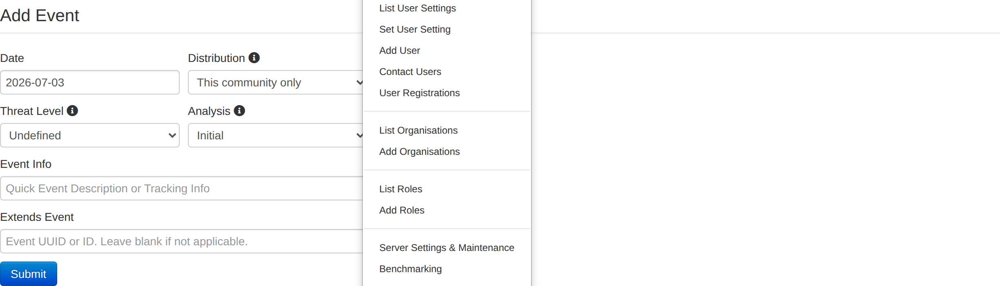
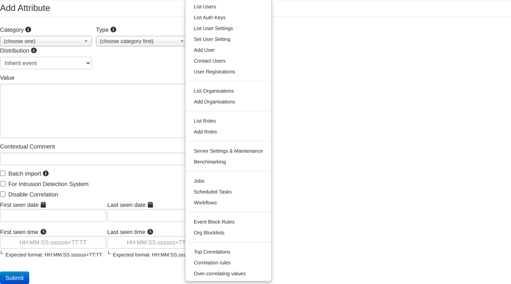
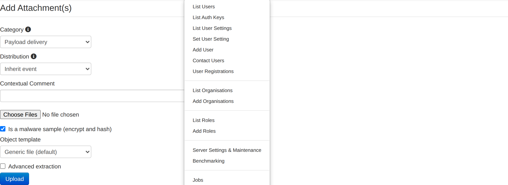
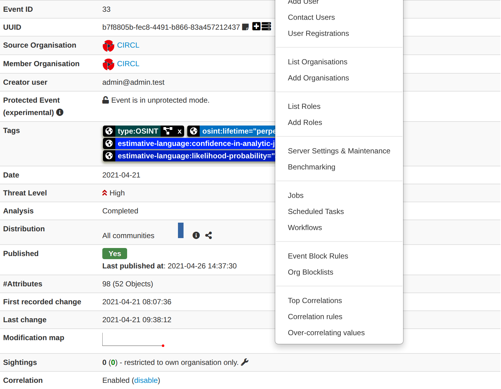
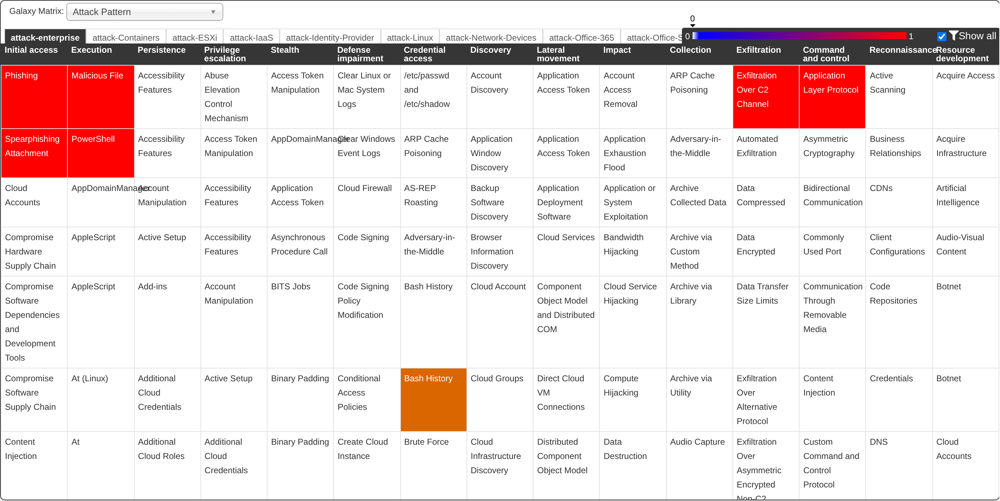
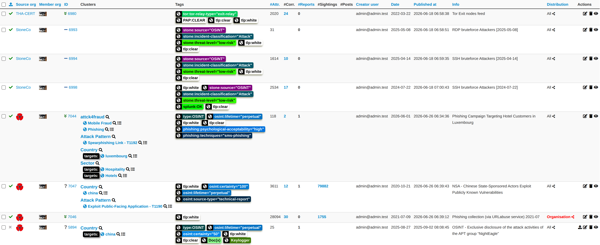
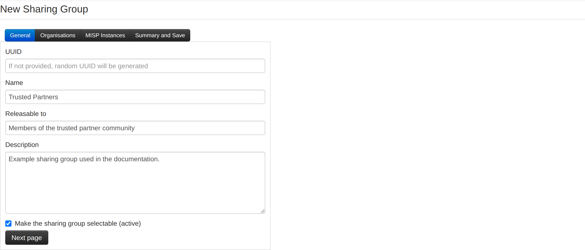
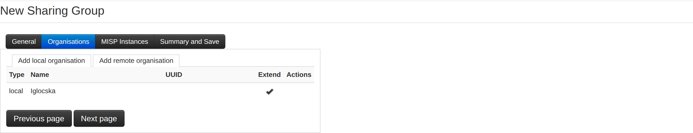
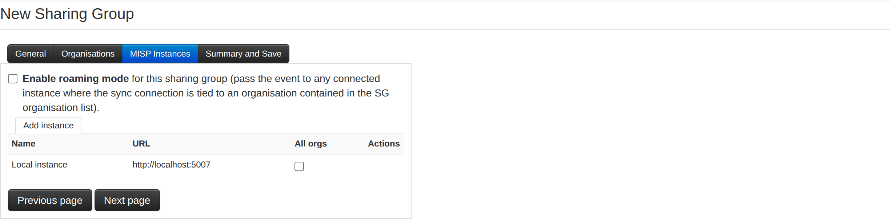
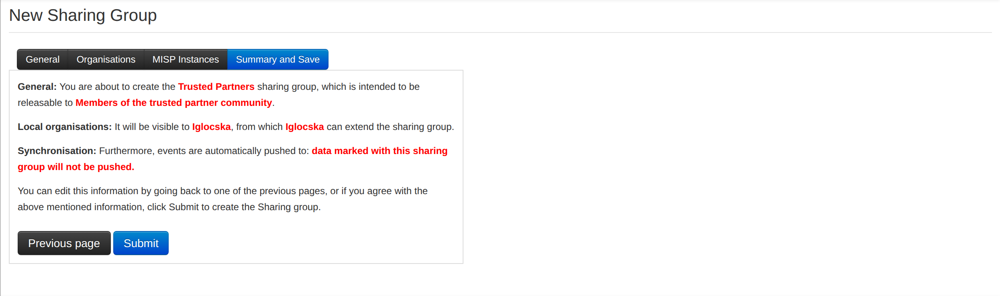

This chapter walks through the day-to-day work of an analyst in the MISP web
interface: creating events, populating them with attributes and objects, adding
context (tags, galaxies, analyst data), collaborating with other organisations,
and finally publishing and sharing your findings. Individual subsystems have
their own dedicated chapters — this chapter shows how they come together in the
normal event workflow and links out for the details.

## The event lifecycle

In MISP, an **event** is a container that groups a set of related indicators and
their context — typically everything you know about a single incident, campaign,
report or collection. A typical event goes through the following stages:

1. **Create** the event with a short set of metadata (date, distribution, threat
   level, analysis stage, a descriptive title).
2. **Populate** it with data — attributes (individual indicators), objects
   (structured groups of attributes), and attachments.
3. **Contextualise** the data with tags, taxonomies, galaxy clusters and analyst
   data so consumers understand what it means and how much to trust it.
4. **Collaborate** — receive proposals and sightings, discuss, and optionally
   delegate the event to another organisation.
5. **Publish** the event, which makes it available to the eligible exports,
   notifies subscribers, and pushes it to the instances you synchronise with.

Editing an event (or any of its data) after publication automatically
un-publishes it; you republish once you are done.

## Creating an event {#creating-an-event}

During this first step you create a skeleton event that holds only general
information — you populate it with attributes and objects in the next stage. To
start, click the **Add Event** button in the left-hand menu and fill out the
form.

The form contains the following fields (in order):

*   **Date:** The date the incident took place (not to be confused with the
    event's creation date). Click the field to open a date-picker; it defaults to
    today.
*   **Distribution:** Controls who will be able to see this event once it is
    published, and whether — and how — it is synchronised to other servers. The
    distribution is inherited by the event's data: the most restrictive setting
    of the event and the individual attribute always wins. The options are:
    *   **Your organisation only:** Only members of your organisation can see the
        event. It will not be synchronised. *(Upon push: not pushed. Upon pull:
        pulled.)*
    *   **This community only:** Everyone in your MISP community — your own
        organisation, other organisations on this server, and organisations on
        servers that synchronise with this one — can see it. *(Upon push: not
        pushed. Upon pull: pulled and downgraded to "Your organisation only".)*
    *   **Connected communities:** As above, plus the organisations one further
        hop away (the communities of the servers your server connects to).
        *(Upon push: downgraded to "This community only" and pushed. Upon pull:
        pulled and downgraded to "This community only".)*
    *   **All communities:** The event is shared freely and can propagate from
        one server to the next without restriction. *(Upon push: pushed. Upon
        pull: pulled.)*
    *   **Sharing group:** The event is shared only with the organisations (and
        instances) defined in a sharing group, giving you fine-grained control.
        Selecting this reveals the **Sharing Group** dropdown. See
        [Create and manage Sharing Groups](#create-and-manage-sharing-groups).

    The pre-selected value follows your instance's `MISP.default_event_distribution`
    setting; review it before saving, as the out-of-the-box default is the most
    permissive level.
*   **Threat Level:** The risk level of the event — **High** (sophisticated APTs
    and 0-day attacks), **Medium** (Advanced Persistent Threats), **Low**
    (general/mass malware), or **Undefined**. The field defaults to *Undefined*
    and can be refined later.
*   **Analysis:** The current stage of your analysis — **Initial**, **Ongoing**
    or **Completed**.
*   **Event Info:** A short, concise description of the event, ideally starting
    with your internal reference. Keep the detail for the attributes — this is a
    title, not a report. Note that the instance may automatically rewrite strings
    that match a regular-expression replacement configured by your administrator.
*   **Extends Event:** Optionally turn this event into an
    [extension](#extending-events) of an existing event by entering the parent
    event's UUID or ID. A live preview of the parent event is shown as you type.
    Leave blank if not applicable.

::: {.callout-tip}
If your instance has event templates configured, the Add Event page offers a
**Create event via template instead** shortcut. Templates give you a guided,
pre-filled walkthrough (with attached objects and mandatory-field checks) instead
of the blank form — handy for recurring report types.
:::

## Populating an event with data

Once the skeleton event exists you can add data to it. Everything is driven from
the event view's left-hand menu; the main entry points are **Add Attribute**,
**Add Object**, **Add Attachment** and **Populate from…** (bulk import). You can
also let MISP extract indicators for you with [enrichment](#enrichment) or from an
[event report](../create-event-report/index.qmd).

### Add Attribute

An **attribute** is a single indicator or piece of context — an IP address, a
hash, a filename, a comment, and so on. Click **Add Attribute** to open the
form.

*   **Category:** What aspect of the incident the attribute describes (for
    example *Payload delivery* or *Network activity*).
*   **Type:** How that aspect is expressed (for example `ip-src`, `sha256`,
    `filename`). The type list is filtered to those valid for the chosen
    category. For the full category/type matrix see
    [Categories and Types](../categories-and-types/index.qmd).
*   **Distribution:** Who can see this attribute. In addition to the five event
    distribution levels, attributes offer **Inherit event** — which keeps the
    attribute's distribution aligned with the event and is the recommended
    default (and the pre-selected value).
*   **Value:** The indicator itself, in a format valid for the chosen type (for
    example `11.11.11.11` for `ip-src`). The value is searched for
    administrator-configured regular-expression replacements on entry, and is
    what the correlation engine matches on.
*   **Contextual Comment:** Free-text notes about the attribute. Comments are not
    used for correlation.
*   **Batch import:** Tick this to paste several values of the same type into the
    value field (one per line) and have MISP create one attribute per line.
*   **For Intrusion Detection System** (`to_ids`): Marks the attribute as an
    actionable indicator of compromise, so it is included in the IDS/detection
    exports (NIDS rules, etc.) unless overridden by a warninglist. Leave it off
    for attributes that are contextual only.
*   **Disable Correlation:** Excludes this individual attribute from the
    correlation engine — useful for values that would otherwise create noisy,
    meaningless matches.
*   **First seen / Last seen:** Optionally record the observation window for the
    indicator using the date-and-time slider. These feed the event timeline and
    are useful for decaying and time-based analysis.

### Add Object

Objects group several related attributes into a single structured unit — a
`file` object bundling a filename with its hashes and size, a `domain-ip` object,
an email object, and so on — using community-maintained templates. Click **Add
Object**, pick a template, and fill in its fields. Objects can also reference one
another (for example, a network-connection object referencing the file that
initiated it). See the [MISP objects](../misp-objects/index.qmd) chapter for the
full workflow, including object references and relationships.

### Add Attachment

Use **Add Attachment** to upload files — malware samples, external analysis
reports, or artefacts dropped by the malware.

*   **Category:** What the file describes (defaults to *Payload delivery*).
*   **Distribution:** Who can see the attachment; the same options as attributes.
*   **Contextual Comment:** Optional notes.
*   **Values:** The file(s) to upload — you can select several at once.
*   **Is a malware sample (encrypt and hash):** Checked by default. When set, the
    file is zipped and password-protected (password `infected`) so users cannot
    accidentally execute it, and it is stored as a `malware-sample` object with
    its hashes computed automatically. Untick it only for benign files, which are
    stored as plain `attachment` attributes.
*   **Object template / Advanced extraction:** Choose the object template used to
    represent the upload; when advanced extraction is installed, MISP can pull
    additional attributes out of the file (for example from a PE binary).

### Populate from…

When you already have a list of indicators or a structured export, use **Populate
from…** to create many attributes at once. The button opens a chooser offering:

*   **MISP JSON** — merge event content from a MISP JSON file into this event.
*   **Freetext Import** — paste any block of text (a report, an email, a list of
    IOCs) and let MISP find and classify the indicators.
*   **Populate using a Template** — fill a guided, sectioned form to generate
    attributes.
*   **OpenIOC Import** — import indicators from a `.ioc` file.
*   **ThreatConnect Import** — import from a ThreatConnect CSV export.
*   **(Experimental) Forensic analysis – Mactime** — import a mactime timeline.
*   **Any enabled import module** — additional formats (for example CSV, STIX,
    various vendor reports) provided by [misp-modules](../modules/index.qmd)
    appear here automatically.

The most commonly used option is **Freetext Import**: paste a line-break
separated list of indicators and MISP suggests the most likely category/type for
each one.

Because many values are valid for several category/type combinations, MISP
proposes the most common option and lets you adjust the category, type and IDS
flag per row before saving. Values that already exist elsewhere are flagged with
their correlations, and values that hit a warninglist are highlighted so you can
decide whether to keep them.

## Adding context to your data

Raw indicators are only half the story. MISP offers several complementary ways to
say what your data *means* and how much to trust it.

### Tagging: taxonomies, galaxies and tag collections

Tags classify events and attributes. Next to the **Tags** field on an event (and
on each attribute) you will find two add buttons:

*   **Add a tag** (globe icon) attaches a **global** tag that is shared and
    synchronised along with the event.
*   **Add a local tag** (user icon) attaches a **local** tag that stays on your
    instance only — it is never exported or synchronised. Local tags can only be
    applied by users of the instance's host organisation.

Clicking either button opens a two-step picker. The first step lets you choose
from your **Favourite Tags**, **Tag Collections**, **Custom Tags**, **All Tags**,
or a specific **Taxonomy Library** (one entry per enabled taxonomy). The second
step lets you pick the actual tag/predicate value. Taxonomies are curated,
machine-readable tag vocabularies (TLP, PAP, admiralty-scale, and many more) —
see the [Taxonomies](../taxonomy/index.qmd) chapter.

**Galaxy clusters** are attached through a separate control (the **Galaxies**
field, with its own *Add new cluster* / *Add new local cluster* buttons). While
they are stored as tags under the hood, galaxies represent richer knowledge
objects — threat actors, malware families, MITRE ATT&CK techniques, sectors, and
so on — with descriptions, synonyms and relationships. See the
[Galaxies](../galaxy/index.qmd) chapter.

**Tag collections** let you apply a curated bundle of tags in one action — pick
the *Tag Collections* entry in the tag picker and the collection's member tags
are expanded onto the target.

### Analyst data: notes, opinions and relationships

Beyond tags, MISP lets analysts annotate almost any element — events, attributes,
objects, galaxy clusters, event reports, and even other annotations — with
**analyst data**:

*   **Notes** — free-text commentary in Markdown.
*   **Opinions** — an explicit confidence/agreement score (0–100) with an
    optional comment, so consumers can see whether the community trusts a piece
    of data.
*   **Relationships** — typed links from one element to another (including
    elements in other events), building a graph of related intelligence.

Analyst data is created from the context icon shown next to an element's UUID and
is shared and synchronised alongside the data it annotates.

### Enrichment

MISP can automatically look up extra information for your data through
[misp-modules](../modules/index.qmd):

*   **Enrich Event** (left-hand menu) runs the applicable expansion modules
    against the whole event as a background job and appends the results.
*   On an individual attribute, the **Add enrichment** action (asterisk icon)
    queries expansion modules that support that attribute's type; **Query
    Cortex** does the same via Cortex analysers where configured.
*   If hover enrichment is enabled on your instance, hovering over (or clicking
    the magnifier on) a value shows on-the-fly lookups without leaving the page.

### Decaying scores

If your administrator has configured decaying models, attributes can carry a
**decaying score** column showing, per model, how relevant the indicator still is
over time (green while valid, red once it has decayed). Clicking a score opens
the decay simulation tool. Decaying lets consumers automatically age out stale
indicators instead of trusting them forever.

## The event view

The event view is where you spend most of your time. It shows the event's
metadata, a set of collapsible content panels, and the full attribute/object
table with inline tools.

### General event information

The information block at the top of the view shows (depending on your
permissions and the event's state):

*   **Event ID** and **UUID** — the UUID row also offers quick actions to *extend
    this event* and to *check this event on other servers*.
*   **Creator org** / **Owner org** — the organisation that authored the event
    versus the organisation that owns the local copy (the latter is visible to
    site admins).
*   **Contributors** — organisations that contributed via proposals; click a logo
    to see a filtered history.
*   **Protected Event** — when present, the event is cryptographically signed so
    recipients can verify it has not been tampered with in transit.
*   **Tags**, **Date**, **Threat Level**, **Analysis**, **Distribution** — the
    metadata set on creation, editable inline.
*   **Warnings** — data-quality or security warnings about the event.
*   **Published** — whether the event is published, together with its first- and
    last-published timestamps.
*   **#Attributes** — the attribute count, with the number of objects in
    parentheses.
*   **First recorded change / Last change / Modification map** — when the event
    changed, with a sparkline of edit activity.
*   **Extends / Extended by** — links to the parent or child events when this
    event is part of an [extended event](#extending-events).
*   **Sightings / Activity** — how many times the event's data has been seen (with
    an activity sparkline) and a shortcut to advanced sightings.
*   **Correlation** — whether correlation is enabled for the event, with a toggle
    to turn it off (useful for large, low-value events).

The right-hand column adds side panels for **related events**, **related feeds**
and **related servers** where applicable.

### Content toggles

A row of toggle buttons controls which panels are shown in the main content
area. You can collapse and expand each independently:

1.  **Pivots** — the pivot thread graph of events you have traversed (see below).
2.  **Galaxy** — the galaxy clusters attached to the event.
3.  **Event graph** — an interactive graph of the event's objects, attributes and
    their references/relationships.
4.  **Event timeline** — a time-based view built from the attributes' first/last
    seen values.
5.  **Correlation graph** — a graph of the events this one correlates with.
6.  **Galaxy matrix** — the ATT&CK-style matrix highlighting the techniques
    present in the event.
7.  **Event reports** — the rich-text [event reports](../create-event-report/index.qmd)
    attached to the event (this panel opens automatically when reports exist).
8.  **Attributes** — the attribute and object table (see below).
9.  **Discussion** — the event's discussion thread (shown when you have access to
    discussions).

When you open the **Galaxy matrix** panel on an event carrying ATT&CK galaxy
clusters, MISP highlights the techniques present in the event on the matrix:

### The attribute table

The **Attributes** panel lists every attribute and object in the event. The
columns include the date, a context icon (analyst notes/opinions/relationships),
category, type, value, tags, galaxies, comment, correlation and related events,
IDS flag, distribution, sightings and activity, and — when enabled — SightingDB
and decaying-score columns.

Each row offers inline tools (subject to your permissions):

*   **Inline edit** — click a category, type, value, comment or distribution cell
    to edit it in place.
*   **Sightings** — thumbs-up to add a sighting, thumbs-down to mark a false
    positive, and a wrench for advanced sighting options. See
    [Sightings](../sightings/index.qmd).
*   **Enrichment** — the asterisk (expansion modules) and eye (Cortex) icons, as
    described under [Enrichment](#enrichment).
*   **Edit / Delete** — standard actions; deletion is a soft delete on published
    events (so it can propagate) and can be restored, or a permanent delete on
    events that were never published.
*   **Tag / Galaxy** — add tags or galaxy clusters directly on the row.

Attributes that belong to an object are grouped under that object; proposals
appear inline with the attribute they affect (see
[Proposing changes](#proposing-changes-to-another-organisations-event)).

### Pivoting and related events

Two events are *related* when they share one or more attribute values (for
example both contain `11.11.11.11`). Related events are listed in the right-hand
panel as links. Moving from one event to another through these links is called
**pivoting**, and MISP records the path in the **Pivots** panel: each visited
event is a bubble connected to the one you came from, letting you branch, jump
back, and prune the graph. The pivot thread resets when you navigate away from
the event view.

### Event discussion

Every event has its own discussion thread where eligible users can talk about it.
Posters are shown by organisation and an anonymised user identifier (their email
is only visible to members of their own organisation). Use the quick-response
field at the bottom of the thread to post without reloading the page, and the
`[quote]`, `[event]` and `[thread]` tags to quote a post or link to another event
or thread.

## Collaborating on events

### Proposing changes to another organisation's event

If you can see an event created by another organisation but cannot edit it
directly, you can suggest changes as **proposals** (shadow attributes). Use the
propose buttons that replace the add/edit controls to propose a new attribute or
a change to an existing one; the creating organisation can then accept or discard
your proposal.

When the creating organisation is on another instance, they receive your proposal
on their next pull, and republishing the event sends the accepted change back to
you. For richer, non-destructive collaboration (commentary, confidence, typed
links) consider [analyst data](#analyst-data-notes-opinions-and-relationships)
instead.

### Sightings

A **sighting** records that you actually observed an indicator (or that it is a
false positive). Sightings are a lightweight, high-signal form of feedback that
feeds decaying and lets producers see which indicators are still active. Add them
from the thumbs-up/thumbs-down icons on each attribute row, or in bulk. See the
[Sightings](../sightings/index.qmd) chapter for sighting policies, anonymisation
and SightingDB.

### Contacting the reporter

To reach the organisation that reported an event, open the event and click
**Contact Reporter** (available when the creating organisation is local to your
instance). Your message is emailed together with the event's details.

By default every member of the reporting organisation is emailed; tick the
checkbox to reach only the individual reporter.

### Delegating an event

You can ask another organisation to (re)publish an event on your behalf — for
example to publish anonymously through a trusted partner. Use **Delegate
Publishing** from the event menu; the recipient sees the request under *View
delegation requests* and can accept or discard it. See the
[Delegation](../delegation/index.qmd) chapter for the full flow.

## Publishing an event {#publish-an-event}

Once the event holds everything you want to share, finalise it by publishing.

Publishing an event:

*   makes its data available to all eligible exports (and readies IDS-flagged
    attributes for detection-rule generation);
*   emails subscribed, eligible users (those with auto-alert enabled and the
    right to see the event); and
*   pushes the event to the instances you synchronise with, from where it
    propagates further according to the distribution rules.

The event menu offers several variants:

*   **Publish** — the normal publish, with notification emails.
*   **Publish (no email)** — publish without alerting anyone; use it for minor
    edits.
*   **Unpublish** — retract a published event.
*   **Publish Sightings** — push sighting updates without republishing the whole
    event.
*   **Delegate Publishing** — hand publication to another organisation (see
    [above](#delegating-an-event)).
*   **Publish to ZMQ / Kafka** — emit the event to the real-time
    [ZeroMQ](../misp-zmq/index.qmd) or Kafka feeds, when those plugins are
    enabled.

If your instance has background jobs enabled, publication is queued and may not
complete instantly.

## Extending events

An **extended event** lets you build on an existing event without editing it —
ideal for adding your own analysis to a report you received, or for maintaining a
long-running campaign event as a series of contributions. Create one either by
entering the parent's UUID in the **Extends Event** field when
[creating an event](#creating-an-event), or with **Extend this event** from an
existing event's UUID row. The event view can then show the combined
(extended) picture, and search filters let you include or isolate extensions. See
the [Extended events](../extended-events/index.qmd) chapter.

## Browsing and searching

### Listing events

**List Events** (left-hand menu) shows the most recent events. The list includes,
among other columns, the published state, creator and owner organisations, tags
and galaxies, the attribute count, the event date, threat level, analysis stage,
the event info, distribution, and per-row action buttons (view, edit, publish,
delete — subject to your permissions).

Use the filter/query controls at the top of the index to narrow the list by any
combination of criteria, and the scope tabs to switch between your organisation's
events and everything you can see.

### Listing and searching attributes

**List Attributes** produces a comparable list at the attribute level.

To find specific data, use the attribute search, which is backed by the same
powerful query engine as the [REST API](#rest-api): search by value, type,
category, tag, organisation, date range and more, and export the result set
directly. Because the search UI and the API share the same filters, anything you
can find interactively you can also automate.

## Editing events and attributes

Every event and attribute can be edited. Find it (by browsing or searching), then
use the edit control — for attributes you can also edit most fields inline in the
attribute table, or double-click an event in a list to jump straight into edit
mode. The edit form is the same as the corresponding creation form, pre-filled
with the current values. Remember that editing an event (directly, or indirectly
by changing one of its attributes) un-publishes it, so you will need to publish
again once you are done.

## Create and manage Sharing Groups {#create-and-manage-sharing-groups}

Sharing groups are re-usable, fine-grained distribution lists. They let you
combine organisations from your own instance (local organisations) with
organisations from directly or indirectly connected instances (external
organisations), and control exactly which instances the data may travel to.
Sharing groups can be created by any user with the *sharing group editor*
permission, and edited by members of the creating organisation or of any
organisation marked as an **extender** — the mechanism for delegating membership
management to a trusted partner (for example a sector representative who knows who
should be included).

Use sharing groups when the standard distribution levels cannot express the
sharing you need; otherwise prefer the simpler distribution levels, and prefer
the *Inherit event* distribution on attributes whenever their sharing group would
match the event's. Sharing groups can add complexity for users and some
processing overhead on the data marked with them.

Create and edit sharing groups from **Global Actions → List Sharing Groups /
Add Sharing Group**. The editor is a wizard with four tabs:

*   **General:** Metadata describing the group.
    *   **Name:** The unique name of the sharing group.
    *   **Releasable to:** A human-readable description of who the data may be
        shared with. This is informational only (aimed at extender
        organisations); MISP does not enforce it.
    *   **Description:** A natural-language statement of the group's intent.
    *   **Make the sharing group selectable (active):** Uncheck to retire a group
        — existing data keeps honouring it, but it is no longer offered when
        setting distribution, reducing clutter.

*   **Organisations:** The list of organisations named in the group, split into
    **local** and **remote/external** tabs. (Local organisations have at least one
    local user; remote organisations are created automatically when
    synchronising. A remote organisation can be converted to local if one of its
    users later joins your instance.) Tick **extend** to let an organisation edit
    the sharing group — the creating organisation is always an extender.

*   **MISP Instances:** The instances the data may be synchronised to. Any user
    who can see the event on a given instance may pull it, but the organisation
    distribution list still applies.
    *   **Enable roaming mode:** Ignore the instance list and rely purely on the
        organisation list — an instance becomes eligible whenever its host
        organisation is in the list. This removes the need to know specific
        instance URLs, at the cost of relying on correctly configured host-org
        settings.
    *   **Add instance:** Add an instance from those configured under *Sync
        Actions → List Servers*.
    *   **All orgs:** Automatically include every organisation on the selected
        instance, without naming them individually — useful for exchanging with a
        whole community, and for privacy-sensitive communities that prefer not to
        enumerate members.

*   **Summary and Save:** A highlighted summary of the whole configuration.
    Review it carefully before saving — mistakes here can expose data to the
    wrong organisations or grant unwanted editing rights. Note that a sharing
    group has no effect until it is selected as the distribution of an event or
    attribute.

## Exporting data

The recommended way to get data out of MISP is the search/export engine
(`restSearch`), which is shared by the web UI, the built-in REST client and the
[automation API](../automation/index.qmd).

For a single event, use **Download as…** in the event menu to export it in any of
the supported formats — MISP JSON/XML, OpenIOC, CSV (with or without context),
STIX 1 and 2, RPZ, Suricata/Snort/Bro rules, a plain-text value list, and any
enabled export module. Each option is generated on demand from the current data.

For bulk and automated export, drive `/events/restSearch` and
`/attributes/restSearch` directly (or through the REST client), which accept the
same filters as the search UI and return the same wide range of formats. See the
[automation](../automation/index.qmd) chapter for the full parameter and format
reference.

::: {.callout-note}
The older two-page cached-export page (previously reached via *Export*) is
disabled by default on current instances in favour of `restSearch`; you may not
see it at all.
:::

## Connecting to other instances

Synchronising with other MISP servers — adding sync connections, configuring push
and pull rules, and running feeds — is covered in the
[Sharing & synchronisation](../sharing/index.qmd) chapter (server administration)
and the [Managing feeds](../managing-feeds/index.qmd) chapter. Setting up sync
also depends on having an appropriately configured sync user and authentication
key, described in [Administration](../administration/index.qmd).

## REST API {#rest-api}

MISP exposes a full REST API for programmatic access to events, attributes and
almost every other object, using JSON (or XML) over HTTP with an API key. The
canonical reference — authentication, the `restSearch` filters, the complete list
of return formats, and the interactive OpenAPI documentation and built-in REST
client — lives in the [Automation & API](../automation/index.qmd) chapter. For
Python, see [PyMISP](../pymisp/index.qmd).

## Multi-factor authentication (TOTP/HOTP)

MISP supports time-based and counter-based one-time-password multi-factor
authentication (TOTP/HOTP). For how to enable and configure it instance-wide, see
the [Administration](../administration/index.qmd) chapter.

### Generating TOTP/HOTP tokens

From the top menu bar, go to **Global Actions → My Profile** and click the
**TOTP Generate** button.

On the next screen, add the secret to your preferred authenticator application
(for example a mobile authenticator or a desktop tool) and confirm the setup by
entering a verification code.

Once validated, you are shown a set of 50 single-use HOTP (paper) tokens as a
fallback for when your authenticator is unavailable.

You can view these tokens again later from your profile via the **View paper
tokens** button.

### Logging in with TOTP/HOTP

After setting up TOTP/HOTP, you are prompted for a one-time password on
subsequent logins.

Enter either a code from your authenticator or one of the numbered paper tokens.

### Deleting and regenerating tokens

Removing a user's TOTP/HOTP setup can only be done by site or organisation
admins. Contact your organisation admin (preferred) or a site admin if you need
to reset your tokens.

### Combining multiple factors

You cannot combine multiple forms of multi-factor authentication at once: once
TOTP/HOTP is assigned to your user, email OTP is not also used for it. If your
instance has email OTP configured, it applies again once your TOTP/HOTP setup is
removed.
