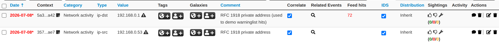
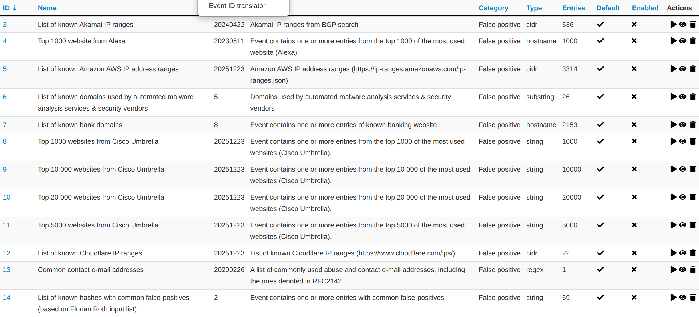
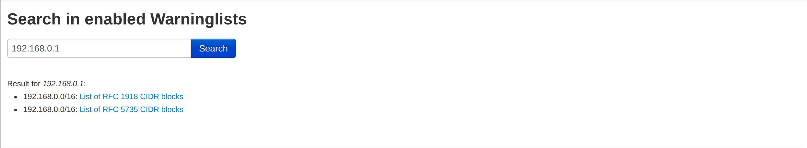

MISP warning lists contain well-known indicators that may correspond to false positives, errors, or mistakes.
There is also a Python module for working with warning lists in a Pythonic way: [PyMISPWarningLists](https://github.com/MISP/PyMISPWarningLists).
[MISP Warning Lists GitHub Repository](https://github.com/MISP/misp-warninglists)

## Warning Lists and False Positives

False positives are a common issue in threat intelligence sharing.
They are often contextual:
- What counts as a false positive may differ from one sharing community to another.
- Organizations may also have their own view of what should be treated as a false positive.

## Usage
By default, MISP triggers warning list hits only when the attribute IDS flag is set.
You can change this behavior by setting the `MISP.warning_for_all` configuration parameter to `true`.

When an attribute matches a warninglist entry, an info/warning box is displayed at the event and attribute level, as can be seen in the screenshot below.

Individual warning lists can be enabled or disabled at the instance level from the warning lists index page.
Examples of default warning lists include known public DNS resolvers, multicast IP addresses, hashes for empty values, RFC1918 ranges, TLDs, and known Google domains.

Warning lists can be extended locally in JSON or contributed through pull requests to https://github.com/MISP/misp-warninglists.
They can also be used for critical infrastructure, core infrastructure, or personally identifiable information.

### Warninglists and data export
The enforceWarninglist parameter of MISP restSearch can be used to exclude attributes that have a warninglist hit from the export. For more information on the MISP API, please refer to the [Automation and MISP API chapter](../sharing/).

### Check individual values for warning list hits
It is also possible to do a lookup for a specific value in the warninglists. This functionality is accessible by using the top menu "Input Filters" > "List Warninglists" and then using the link in the left side menu bar (or by browsing directly to [misp_base_url]/warninglists/checkValue). Only enabled warninglists will be searched.

### Updating warninglists
An update of the warninglists can be triggered via the GUI using the "Update Warninglists" button in the side menu bar when viewing any of the relevant warninglists pages, for example the index page.

Alternatively, it is also possible to trigger an update using a CLI command.
~~~
MISP/app/Console/cake Admin updateWarningLists
~~~

If you are updating an existing warning list, make sure you increment the version number before triggering the update in MISP.
You can also contribute to the existing warning lists by forking the [MISP Warning Lists GitHub Repository](https://github.com/MISP/misp-warninglists), making your changes, and then opening a pull request.

### Creating a custom warninglist
1. Create a new directory for your warninglist in /var/www/MISP/app/files/warninglists/lists.
2. Add a file called list.json to the newly created directory and add the content you want. You can use any of the existing warning lists in https://github.com/MISP/misp-warninglists as reference.
3. Trigger an update of the warning lists on the instance to load in your new warning list.

Example use cases include a list of domain names owned by your organization or a list of employee email addresses.
